# 1.指令编码(硬编码)的结构图

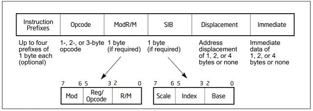

详细表格见[Intel手册卷2 B————>APPENDIX A OPCODE MAP————>ONE, TWO, AND THREE-BYTE OPCODE MAPS]()

# 2.前缀指令 (分四组，最多四个，每组最多一个)


<1>  LOCK  和 REPEAT前缀指令：

	LOCK     		F0    锁地址总线，多核同步使用
	REPNE/REPNZ	        F2   EFLAGS ZF为0 重复执行
	REP/REPZ		F3     EFLAGS ZF为1 重复执行

<2>  段前缀指令：

	CS(2E)、SS(36)、DS(3E)、ES(26)、FS(64)、GS(65)   改变默认访问内存地址时使用的段寄存器

<3>  操作数宽度前缀指令：

	66  改变操作数宽度 (32位←→16位 双向改变)

<4>  地址宽度前缀指令：	

	67  改变CPU寻址方式 (32位←→16位 双向改变)

# 3.经典定长指令-修改寄存器ERX (ERX代表8个通用寄存器)

<1> PUSH/POP  （指令大小1byte）

	0x50 	PUSH EAX
	0x51 	PUSH ECX
	0x52 	PUSH EDX
	0x53 	PUSH EBX
	0x54 	PUSH ESP
	0x55 	PUSH EBP
	0x56 	PUSH ESI
	0x57 	PUSH EDI
		
	0x58	POP EAX
	0x59	POP ECX
	0x5A	POP EDX
	0x5B 	POP EBX
	0x5C 	POP ESP
	0x5D 	POP EBP
	0x5E	POP ESI
	0x5F 	POP EDI

<2> INC/DEC  （指令大小1byte）

	0x40 - 0x47		INC ERX
			
	0x48 - 0x4F		DEC ERX

<3> MOV Rb, Ib    ( 指令大小2byte . Rb为16位通用寄存器，Ib为 Immediate Byte  一字节立即数)

	0xb0 - 0xb7		MOV Rb, Ib

<4> MOV ERX, Id  ( 指令大小5byte . Id为 Immediate Dword 四字节立即数)

	0xb8 - 0xbF		MOV ERX, Id

<5> XCHG  EAX, ERX  （指令大小1byte）

	0x90 - 0x97		XCHG EAX, ERX

# 4.经典定长指令-修改EIP

**1、0x70 - 0x7F**

<1> 条件跳转，后跟一个字节立即数的偏移(有符号)，共两个字节。		
<2> 如果条件成立，跳转到 当前指令地址 + 当前指令长度 + Ib		
<3> 最大值：向前跳7f，向后跳80							
							
	0x70  	JO						
	0x71	JNO						
	0x72	JB/JNAE/JC						
	0x73	JNB/JAE/JNC						
	0x74	JZ/JE						
	0x75	JNZ/JNE						
	0x76	JBE/JNA						
	0x77	JNBE/JA						
	0x78	JS						
	0x79	JNS						
	0x7A	JP/JPE						
	0x7B	JNP/JPO						
	0x7C	JL/JNGE						
	0x7D	JNL/JGE						
	0x7E	JLE/JNG						
	0x7F	JNLE/JG	

**2、0x0F 0x80 - 0x0F 0x8F**

<1> 条件跳转，后跟四个字节立即数的偏移(有符号)，共五个字节。
<2> 如果条件成立，跳转到 当前指令地址 + 当前指令长度 + Id		
<3> 最大值：向前跳7FFFFFFFF，向后跳80000000
						
	0x0F 0x80  		JO				
	0x0F 0x81		JNO				
	0x0F 0x82		JB/JNAE/JC				
	0x0F 0x83		JNB/JAE/JNC				
	0x0F 0x84		JZ/JE				
	0x0F 0x85		JNZ/JNE				
	0x0F 0x86		JBE/JNA				
	0x0F 0x87		JNBE/JA				
	0x0F 0x88		JS				
	0x0F 0x89		JNS				
	0x0F 0x8A		JP/JPE				
	0x0F 0x8B		JNP/JPO				
	0x0F 0x8C		JL/JNGE				
	0x0F 0x8D		JNL/JGE				
	0x0F 0x8E		JLE/JNG				
	0x0F 0x8F		JNLE/JG	

**3、其他指令**

0xE0  	LOOPNE/LOOPNZ Ib (Jb)			共2字节

	ECX = ECX - 1  当ZF = 0 && ECX!=0 时跳转到 当前指令地址 + 当前指令长度 + Ib 

0XE1     	LOOPE/LOOPZ Ib (Jb)			共2字节

	ECX = ECX - 1  当ZF = 1 && ECX != 0 时跳转到 当前指令地址 + 当前指令长度 + Ib

0XE2	LOOP Ib (Jb)				共2字节

	ECX = ECX - 1  当 ECX!=0 时跳转到 当前指令地址 + 当前指令长度 + Ib

0XE3	JrCXZ Ib (Jb) (在32位模式中,rCX为ECX)	共2字节

	当 ECX = 0 时跳转到 当前指令地址 + 当前指令长度 + Ib	
	(自己控制步长)

0xE8	CALL Id (Jd)  			共5字节

	CALL指令的下一条指令地址入栈后，跳转到 当前指令地址 + 当前指令长度 + Id	

0xE9	JMP Id (Jd)				共5字节

	跳转到 当前指令地址 + 当前指令长度 + Id

**4、其他指令** 

8个段寄存器： ES CS SS DS FS GS LDTR TR (顺序固定)
					
0xEA	JMP Ap （Ap：六字节长度的直接地址）		共7字节

	JMP CS:Id  将Ap中的高2位赋值给CS，低4位直接赋值给EIP， 即跳转

0xEB	JMP Ib (Jb)

	跳转到 当前指令地址 + 当前指令长度 + Ib

0xC3 	RET				共1字节	
		
	EIP出栈
								
0xC2	RET Iw				共3字节
		
	EIP出栈后，ESP = ESP + Iw

0XCB	RETF （return far） 			共1字节

	出栈8个字节，低4个字节赋值给EIP,高4个字节中低2位赋值给CS 	

0xCA	RETF Iw				共3字节		

	出栈8个字节，低4个字节赋值给EIP,高4个字节中低2位赋值给CS后，ESP = ESP + Iw 

# 5.经典变长指令-ModR/M字段

下面以MOV的变长指令举例

	0x88  	MOV Eb, Gb   G:通用寄存器
		
	0x89	MOV Ev, Gv   E:寄存器/内存
		
	0x8A	MOV Gb, Eb   b:字节
		
	0x8B	MOV Gv, Ev   v:Word, doubleword or quadword , depending on operand-size attribute


当指令中出现内存操作对象的时候，就需要在操作码后面附加一个字节来进行补充说明，这个字节被称为ModR/M.
该字节的8个位被分成了三部分:


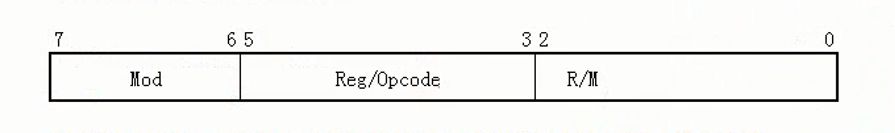

其中,Reg/Opcpde (第3，4，5位，共3个字节) 描述指令中的G部分，即寄存器（Reg/Opcpde 也有可能用来描述操作码，看第一个opcode来具体分析）

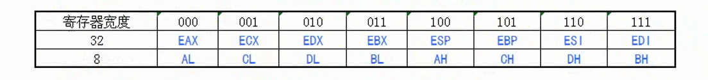

Mod(第6，7位)和R/M(第0，1，2位)共同描述指令中的E部分，即寄存器/内存

那么，这8个位具体是如何工作的呢，Intel操作手册给出了一张表

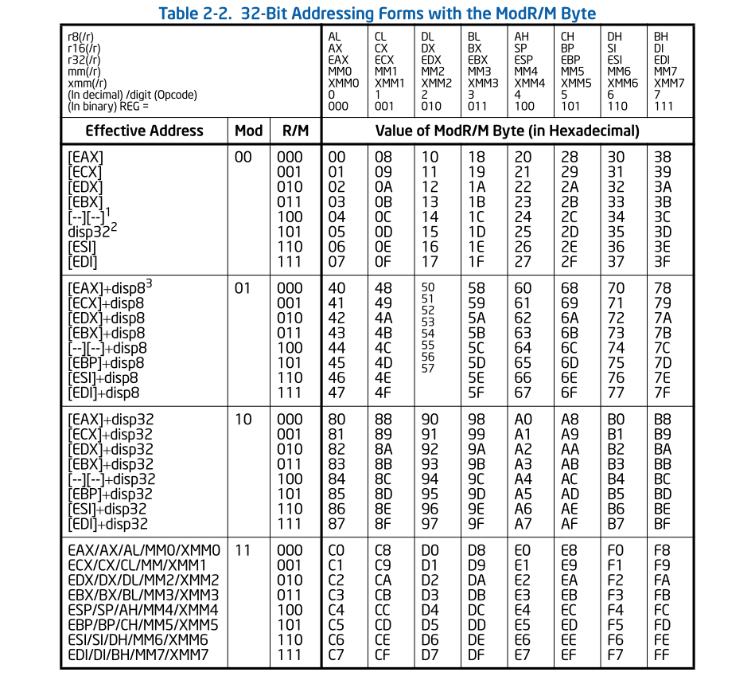


前面我们已经讨论了Reg/Opcode部分（即3，4，5位）是怎样描述寄存器的，接下来我们重点说一下Mod和R/M是怎样合作描述寄存器/内存的

**当 Mod == 0 时，ModR/M字节通过寄存器直接进行内存寻址**

例如当操作指令为 88 01 时，其对应的汇编为`MOV BYTE PTR DS:[ECX],AL`

88 是操作指令，其后跟随的01为ModR/M

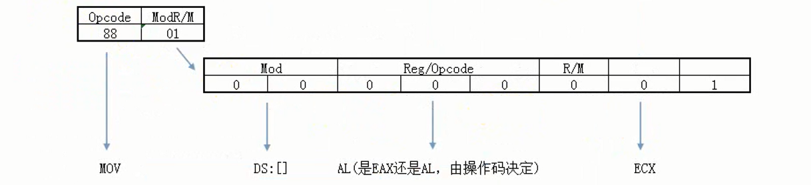

0x88描述了操作数宽度为b(byte)，且操作数的顺序为Eb Gb,所以这条汇编指令为`MOV BYTE PTR DS:[ECX],AL`

同理可以分析出如下操作指令对应的汇编指令


1,ESP指向栈顶。是浮动的，不确定的。Intel将这个编码废弃，由另外的格式说明。

2,EBP指向栈底，而[EBP]通常存储上一个EBP,所以[EBP]无数据操作意义，Intel将这个编码废弃，改为立即数寻址


# 6.经典定长指令-SIB字段

ModR/M字段是用来是用来进行内存寻址的，可当地址形如DS:[EAX+ECX*2+12345678]时，仅仅靠ModR/M字段是描述不出来的。这时就在ModR/M后面增加一个SIB字节，与ModR/M字段共同描述。

下图是之前没有涉及到的三种情况:


这三种情况表示，在ModR/M字节后，还紧跟着一个SIB字节，SIB字节的8位被分成了三部分：

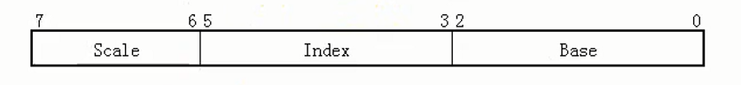

在例子DS:[EAX+ECX*2+12345678] 中，Scale描述 2^1 ,Index 描述ECX，Base描述EAX，而12345678 由ModR/M字段决定。

所以SIB字段描述的方式为：

**Base + Index \* 2^Scale (Scale描述2^Scale 所以只能为 \*1 \*2 \*4)**

下面我们通过分析指令，看看SIB是怎么工作的

**MOV BYTE PTR DS:[EAX+ECX*2+12345678] ,AL**

**操作码**

这条指令的原型为MOV Eb Gb ,所以操作码为0x88。且操作数中有Eb，所以必然存在ModR/M字段

**ModR/M字节**

1.Gb为AL，所以Reg/Opcode部分为000

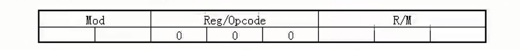

2.内存地址为 寄存器 + I32 的格式，所以Mod部分为10， 偏移为 78563412

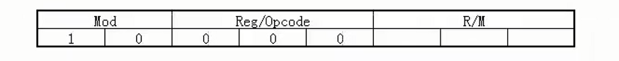

3.内存地址中寄存器部分多个寄存器，即在ModR/M字节后，还跟随着SIB字节，所以R/M部分为100


由此，ModR/M字节为0x84

**SIB字节**

1.DS:[EAX+ECX*2+12345678]中，Base对应着EAX，所以Base部分为000

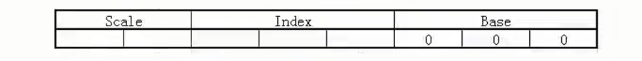

2.Index对应着ECX，所以Index部分为001

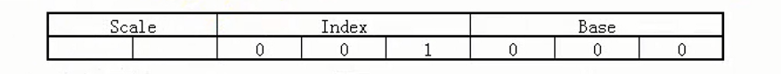

3.Scale对应着21，所以Scale部分为01

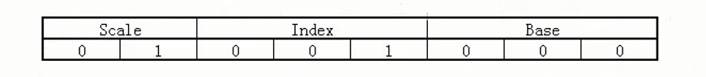

由此，SIB字节为0x48

以上，可总结为如下图


由上，可得出指令编码为 88 84 48 ，再加上偏移12345678，完整的指令编码为88 84 48 12 34 56 78

```python
	888448 12345678  | MOV BYTE PTR DS:[EAX+ECX*2+78563412],AL
```

**SIB字段的图表如下**


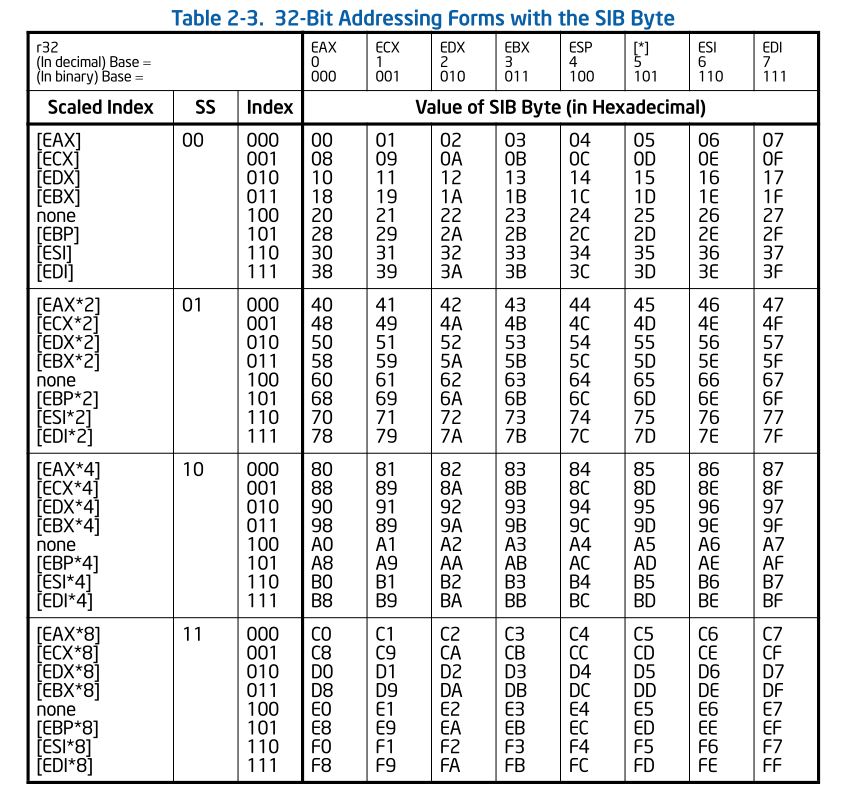

    1.当Index =100时，Index被0替代，此时只有Base有效
    2.当Base =101时，Base被0替代，此时只用Index有效

由此也可以推出，ModR/M整个字段，最长是6个字节