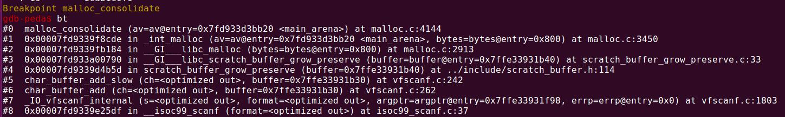
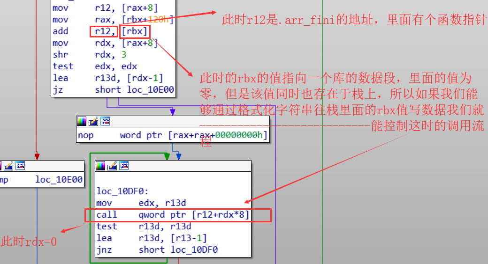

## one_gadgets笔记：

改malloc_hook为one_gadgets,一般malloc触发的方式，one_gadgets由于限制条件不满足，执行都不会成功，可以考虑free两次造成double free，调用malloc_printerr触发，恰好[esp+0x50]=0


在地址上__malloc_hook与__realloc_hook是相邻的，在攻击malloc_hook我们没有能够成功执行one_gadgets，但是我们可以通过将__malloc_hook更改为_libc_realloc+0x14,将__realloc_hook更该为one_gadgets。
这样的好处在于，我们能够控制__malloc_hook指向的代码的内容，规避掉_libc_realloc中部分指令，从而更改在执行one_gadgets时的占空间，创建能够成功执行one_gadgets的栈空间。这是一个很巧妙的点

## 无leak函数的利用笔记：

* 没开PIE的情况

能够修改free_got --> puts_plt,下次释放一个unsorted_bin chunk(入链)或者fastbin chunk(入链)  ,程序调用链 free->free_got->puts_plt->puts 以此泄露libc地址或者heap地址。

* 开启PIE的情况

利用IO_write_base实现leak，详细见[https://sirhc.gitbook.io/note/pwn/iofile-li-yong-si-lu-zong-jie#li-yong-iowritebase-shi-xian-leak](https://sirhc.gitbook.io/note/pwn/iofile-li-yong-si-lu-zong-jie#li-yong-iowritebase-shi-xian-leak)

* 无须泄露，全程爆破的方式(不实用)

[House_of_Roman](https://sirhc.gitbook.io/note/pwn/house_of_roman)

## 构造chunk笔记

构造overlap chunk时，free掉一个构造的chunk,除了要满足下一个chunk的PREV_INUSE域为1，还应当确保堆排序中的topchunk不被破坏，能够正常识别。

## _IO_FILE_笔记
程序调用exit 后会遍历 _IO_list_all,调用 _IO_2_1_stdout_ 下的vatable中_setbuf 函数.程序调用 exit 后,会遍历 _IO_list_all ,调用 _IO_2_1_stdout_ 下的 vatable 中 _setbuf 函数.

## malloc_consolidate笔记

scanf时可输入很长一段字符串 "1"*0x1000,这样可以导致scanf内部扩充缓冲区，从而调用init_malloc来分配更大的空间，从而导致malloc_consolidate，合并fast_bin中的空闲chunk。调用栈如图：



## 程序退出

程序在执行退出流程时，会在ld-x.xx.so这个动态装载器里面调用_dl_fini函数，这个函数，利用方式见下图：



## calloc绕过 leak

2.23及 以上libc都适用

```c
#include<stdio.h>
#include<stdlib.h>
#include<string.h>

typedef long *longptr;

int main()

{
longptr v[7];
long *a,*b,*c;

a=malloc(20);
b=malloc(20);

memset(b,'A',20);
/*
for (int i=0;i<7;i++)
{
v[i]=malloc(20);
}

for (int i=0;i<7;i++)
{
free(v[i]);
}
*/
free(b);
b[-1] |= 2;

c=calloc(1,20);

for (int i=0;i<20;i++)
{
printf("%.2x",((char *)c)[i]);

}
putchar("\n");
exit(0);

}

```

给fastbin_chunk的size的IS_MAPPED域置1.通过calloc分配到时，不会被清空。

```python
chris@ubuntu:~$ ./calloc
00000000000000004141414141414141414141419


```

## stack_povit

栈迁移到.bss段时，执行system函数会报错，通常使用onegadget


## close(1)

```c
#include<stdio.h>
void main()
{
close(1);
write(0,"123",3);
return 0;
}

```

这时能打印123.

close(1)时获取服务器端flag，利用重定向"cat flag >&0"