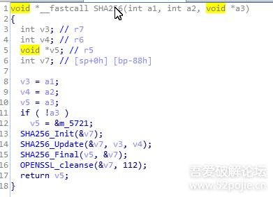
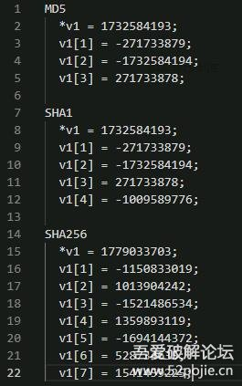

## 算法的类别：

取数据摘要的算法（MD5, SHA*）

对称加密的算法(AES,DES) （核心算法就是各种复杂的位异或）

非对称加密算法（RSA）(私钥，公钥)

## 数据摘要算法（MD5,SHA*）

由三个方法组成:1.初始化        2.运算        3.取结果

进入第一个块（初始化方法），可以看到各种算法的固定常量：

MD5有四个固定常量。SHA1算法又5个固定常量。SHA256算法有8个固定常量。

常见表现形式如下：

## RC4算法的特征：

有两个256次循环

## Base64算法特征:

Base64 是一种基于 64 个可打印字符来表示二进制数据的表示方法。转换的时候，将 3 字节的数据，先后放入一个 24 位的缓冲区中，先来的字节占高位。数据不足 3 字节的话，于缓冲器中剩下的比特用 0 补足。每次取出 6 比特（因为 {\displaystyle 2^{6}=64}），按照其值选择ABCDEFGHIJKLMNOPQRSTUVWXYZabcdefghijklmnopqrstuvwxyz0123456789+/中的字符作为编码后的输出，直到全部输入数据转换完成。

**通常而言 Base64 的识别特征为索引表，当我们能找到 ABCDEFGHIJKLMNOPQRSTUVWXYZabcdefghijklmnopqrstuvwxyz0123456789+/ 这样索引表，再经过简单的分析基本就能判定是 Base64 编码。**

## AES算法特征：

一般AES的密钥长度是128bit 或 256bit，加密出来的数据是128或256的整倍数。

一般情况下密钥都是16字节。

AES的密钥不需要进行初始化，都是直接传明文密钥进来。

方法内有很多复杂的位异或xor。

验证方法:用 hook取得明文传入的密钥，然后经过算法验证是否为AES算法。

如果是CBC算法的，还会拥有一个16字节的IV

## DES算法特征：

密钥长度固定8字节。

密钥需要单独初始化，需要运行一个密钥初始化函数。

会每8字节分段加密。

CBC方式会自带8字节分段加密，ebc方式需要在外面手动分段。

## RSA算法特征：

非对称加密算法

密钥需要单独初始化

密钥长度一般很长，存储格式一般为base64文本

## ECC算法：

密钥需要单独初始化

