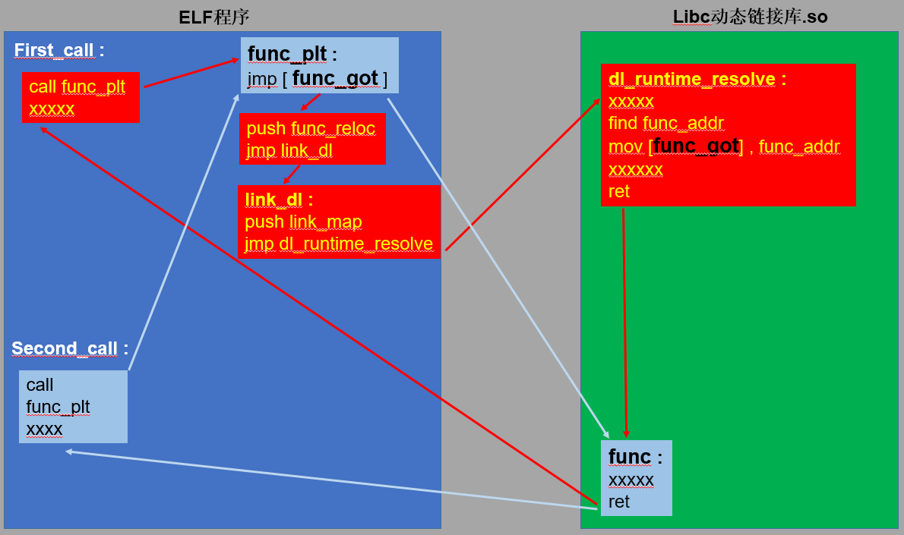

## About GOT and PLT

为了了解`GOT`和`PLT`，首先要知道关于`PIC`的知识，`Position Independent Code(PIC)`是为了是为了重定位动态链接库的`symbols`，现代操作系统不允许修改代码段，只能修改数据段，而使用了动态链接库后函数地址只有在执行时才能确定，所以程序内调用的库中的函数地址在编译时不知道，所以，编译时将函数调用返回`.data`段，而包含`PIC`的程序在运行时需要更改`.data`段中的`GOT`和`PLT`来重定位全局变量。

`Global Offset Table`，也就是`GOT`表为每个全局变量保存了入口地址，在调用全局变量时，会直接调用对应`GOT`表条目中保存的地址，而不调用绝对地址。

`Procedural Linkage Table`，也就是`PLT`是过程链接表，为每个全局变量保存了一段代码，第一次调用一个函数会调用形如`function@PLT`的函数，这就是跳到了函数对应的`PLT`表开头执行，会解析出函数真正的地址填入`GOT`表中，以后调用时会从`GOT`表中取出函数真正的起始地址执行，下面给一张我自己做的调用流程图。




## Environment

```python
root@VirtualBox:~/Desktop$ uname -a
Linux VirtualBox 3.13.0-32-generic #57~precise1-Ubuntu SMP Tue Jul 15 03:50:54 UTC 2014 i686 i686 i386 GNU/Linux
 
root@VirtualBox:~/Desktop$ lsb_release -a
No LSB modules are available.
Distributor ID: Ubuntu
Description:    Ubuntu 12.04.5 LTS
Release:    12.04
Codename:   precise
 
root@VirtualBox:~/Desktop$ gcc -v
gcc version 4.6.3 (Ubuntu/Linaro 4.6.3-1ubuntu5)

```

测试代码:

```c
//test.c
#include <stdio.h>
#include <stdlib.h>
#include <string.h>

int main() {

        printf("aaa");
        char* s = (char *)malloc(300);
        char* s1 = (char*)malloc(248);
        void* a = malloc(0x20);
        free(a);
        free(s);
        free(s1);
        malloc(100);
        malloc(200);
        return 0;
}

```

编译链接:

```python
root@VirtualBox:~/Desktop$ gcc -g test.c -o test
```

## Something about .dynamic

ELF的`.dynamic section`里包含了和重定位有关的很多信息，完整的`.dynamic`段:

```python
root@VirtualBox:~/Desktop$ readelf -d test

Dynamic section at offset 0xf28 contains 20 entries:
  Tag        Type                         Name/Value
 0x00000001 (NEEDED)                     Shared library: [libc.so.6]
 0x0000000c (INIT)                       0x80482f4
 0x0000000d (FINI)                       0x804857c
 0x6ffffef5 (GNU_HASH)                   0x80481ac
 0x00000005 (STRTAB)                     0x804823c
 0x00000006 (SYMTAB)                     0x80481cc
 0x0000000a (STRSZ)                      88 (bytes)
 0x0000000b (SYMENT)                     16 (bytes)
 0x00000015 (DEBUG)                      0x0
 0x00000003 (PLTGOT)                     0x8049ff4
 0x00000002 (PLTRELSZ)                   40 (bytes)
 0x00000014 (PLTREL)                     REL
 0x00000017 (JMPREL)                     0x80482cc
 0x00000011 (REL)                        0x80482c4
 0x00000012 (RELSZ)                      8 (bytes)
 0x00000013 (RELENT)                     8 (bytes)
 0x6ffffffe (VERNEED)                    0x80482a4
 0x6fffffff (VERNEEDNUM)                 1
 0x6ffffff0 (VERSYM)                     0x8048294
 0x00000000 (NULL)                       0x0

```

`GOT`表分成两部分`.got`和`.got.plt`，前一个保存全局变量引用位置，后一个保存函数引用位置，通常说的`GOT`指后面一个，下文GOT即代表`.got.plt`。

`GOT`表的起始地址:

```python
root@VirtualBox:~/Desktop$ readelf -d test | grep GOT
 0x00000003 (PLTGOT)                     0x8049ff4
```

`GOT`表的前三项有特殊含义:

```python
gdb-peda$ x/3x 0x8049ff4
0x8049ff4 <_GLOBAL_OFFSET_TABLE_>:  0x08049f28  0xb7fff918  0xb7ff2650
gdb-peda$ x/i 0xb7ff2650
   0xb7ff2650 <_dl_runtime_resolve>:    push   eax
gdb-peda$ x/x 0x08049f28
0x8049f28 <_DYNAMIC>:   0x00000001
gdb-peda$ x/x 0xb7fff918
0xb7fff918: 0x00000000

```

第一项是`.dynamic`段的地址，第二个是`link_map`的地址，第三个是`_dl_runtime_resolve`函数的地址，第四项开始就是函数的`GOT`表了，第一项就是`printf`条目:

```python
gdb-peda$ x/x 0x8049ff4+0xc
0x804a000 <printf@got.plt>: 0x08048346
```

`PLTRELSZ`指定了`.rel.plt`大小，`RELENT`指定每一项大小，`PLTREL`指定条目类型为`REL`，`JMPREL`对应`.rel.plt`地址，保存了重定位表，保存的是结构体信息:

```python
root@VirtualBox:~/Desktop$ readelf -d test | grep REL
 0x00000002 (PLTRELSZ)                   40 (bytes)
 0x00000014 (PLTREL)                     REL
 0x00000017 (JMPREL)                     0x80482cc
 0x00000011 (REL)                        0x80482c4
 0x00000012 (RELSZ)                      8 (bytes)
 0x00000013 (RELENT)                     8 (bytes)

```

`REL`的数据结构为:

```c
typedef struct
{
  Elf32_Addr    r_offset;               /* Address */
  Elf32_Word    r_info;                 /* Relocation type and symbol index */
} Elf32_Rel;
#define ELF32_R_SYM(val)                ((val) >> 8)
#define ELF32_R_TYPE(val)               ((val) & 0xff)

```

`r_offset`就是对应函数`GOT`表地址，看看`.rel.plt`第一项和第二项:

```python
gdb-peda$ x/2x 0x80482cc
0x80482cc:  0x0804a000  0x00000107
gdb-peda$ x/2x 0x80482cc+0x8
0x80482d4:  0x0804a004  0x00000207

```

再看:

```python
root@VirtualBox:~/Desktop$ readelf -r test

Relocation section '.rel.dyn' at offset 0x2c4 contains 1 entries:
 Offset     Info    Type            Sym.Value  Sym. Name
08049ff0  00000406 R_386_GLOB_DAT    00000000   __gmon_start__

Relocation section '.rel.plt' at offset 0x2cc contains 5 entries:
 Offset     Info    Type            Sym.Value  Sym. Name
0804a000  00000107 R_386_JUMP_SLOT   00000000   printf
0804a004  00000207 R_386_JUMP_SLOT   00000000   free
0804a008  00000307 R_386_JUMP_SLOT   00000000   malloc
0804a00c  00000407 R_386_JUMP_SLOT   00000000   __gmon_start__
0804a010  00000507 R_386_JUMP_SLOT   00000000   __libc_start_main

```

分别和`printf`与`free`对应，`0x0804a000`处就是`printf`的`GOT`表地址。

根据宏定义，由`r_info=0x107`可以知道`ELF32_R_TYPE(r_info)=7`，对应于`R_386_JUMP_SLOT`；其`symbol index`则为`RLF32_R_SYM(r_info)=1`

还有一个需要注意的就是字符串表，保存了一些符号表，在重定位时会用到:

```python
root@VirtualBox:~/Desktop$ readelf -d test | grep STRTAB
 0x00000005 (STRTAB)                     0x804823c
```
查看:

```python
gdb-peda$ x/10s 0x804823c
0x804823c:   ""
0x804823d:   "__gmon_start__"
0x804824c:   "libc.so.6"
0x8048256:   "_IO_stdin_used"
0x8048265:   "printf"
0x804826c:   "malloc"
0x8048273:   "__libc_start_main"
0x8048285:   "free"
0x804828a:   "GLIBC_2.0"
0x8048294:   ""

```

## How ELF relocation works

在第一次`call 0x8048340 <printf@plt>`时会跳到`PLT`段中，第一句会跳到`GOT`条目指向的地址:

```python
gdb-peda$ x/x 0x804a000
0x804a000 <printf@got.plt>: 0x08048346
gdb-peda$ b *0x08048346
Breakpoint 2 at 0x8048346
gdb-peda$ c

```

第一次调用函数时，`GOT`表中的地址为`PLT`表的第二句地址:

```nasm
   0x8048340 <printf@plt>:  jmp    DWORD PTR ds:0x804a000
=> 0x8048346 <printf@plt+6>:    push   0x0
   0x804834b <printf@plt+11>:   jmp    0x8048330
↓
=> 0x804834b <printf@plt+11>:   jmp    0x8048330
 | 0x8048350 <free@plt>:    jmp    DWORD PTR ds:0x804a004
 | 0x8048356 <free@plt+6>:  push   0x8
 | 0x804835b <free@plt+11>: jmp    0x8048330
 | 0x8048360 <malloc@plt>:  jmp    DWORD PTR ds:0x804a008
 |->   0x8048330:   push   DWORD PTR ds:0x8049ff8
       0x8048336:   jmp    DWORD PTR ds:0x8049ffc
       0x804833c:   add    BYTE PTR [eax],al
       0x804833e:   add    BYTE PTR [eax],al
↓
=> 0x8048336:   jmp    DWORD PTR ds:0x8049ffc
 | 0x804833c:   add    BYTE PTR [eax],al
 | 0x804833e:   add    BYTE PTR [eax],al
 | 0x8048340 <printf@plt>:  jmp    DWORD PTR ds:0x804a000
 | 0x8048346 <printf@plt+6>:    push   0x0
 |->   0xb7ff2650 <_dl_runtime_resolve>:       push   eax

```

先push `reloc_offset`，这里是0，再push `link_map`，也就是`GOT`表的第二项，再调用`_dl_runtime_resolve`函数。

`_dl_runtime_resolve`根据`reloc_offset`找到`.rel.plt`段中的结构体:

```python

Elf32_Rel * p = JMPREL + rel_offset;

p的内容:
0x80482cc:  0x0804a000  0x00000107
```

`r_info`为`0x107`。

然后根据`ELF32_R_SYM(r_info)`找到`.dynsym`中对应的结构体:

```python
Elf32_Sym *sym = SYMTAB[ELF32_R_SYM(p->r_info)]
=> sym = SYMTAB[1]
```

`.dynsym`有关的信息为:

```python
root@VirtualBox:~/Desktop$ readelf -d test | grep SYM
 0x00000006 (SYMTAB)                     0x80481cc
 0x0000000b (SYMENT)                     16 (bytes)
```

其实地址为`0x80481cc`，每个结构体大小为`16bytes`，

结构体为:

```c
typedef struct
{
  Elf32_Word    st_name;                /* Symbol name (string tbl index) */
  Elf32_Addr    st_value;               /* Symbol value */
  Elf32_Word    st_size;                /* Symbol size */
  unsigned char st_other;               /* Symbol visibility */
  Elf32_Section st_shndx;               /* Section index */
} Elf32_Sym;

```

所以`SYMTAB[1]`为`0x80481cc+16`:

```python
gdb-peda$ x/5wx 0x80481cc+16
0x80481dc:  0x00000029  0x00000000  0x00000000    0x00000012
0x80481ec:  0x00000049

```

然后根据`sym->st_name`=0x29在`.dynstr`中，也就是`STRTAB`找到函数对应的字符串:

```python
gdb-peda$ x/s 0x804823c+0x29
0x8048265:   "printf"
```
根据函数名字找到对应的地址，填入`GOT`表对应的位置，跳到函数起始地址执行，执行完后，`printf`对应的`GOT`表处已经填上了函数真正的地址:

```python
gdb-peda$ x/x 0x0804a000
0x804a000 <printf@got.plt>: 0xb7e6b8a0

```

## Python Libraries

可借用一些库来生成伪造的符号信息

* roputils

以前被人们使用频率最高的是roputils库，他的ROP里面的子方法`dl_resolve_data`与`dl_resolve_call`，可以生成伪造符号信息与call时的reloc偏移

使用方法：
```python
import roputils
rop = roputils.ROP('./bianry')
dl_resolve_data = rop.dl_resolve_data(base_addr,call_name_addr)
dl_resolve_call = rop.dl_resolve_call(dl_resolve_data_addr, arg_addr)
```
`dl_resolve_data`有两个参数，`base_addr`它声明了生成的`dl_resolve_data`数据的地址，因为我们接下来就要想办法将生成的`dl_resolve_data`数据写入这个地址。`call_name_addr`是你想要调用函数名的字符串指针。

`dl_resolve_call`就是生成劫持地址plt[0]，及reloc参数，和call参数一个`plt_call_gadget`,它的第一个参数是`dl_resolve_data`数据的地址，第二个参数是你想调用函数的参数的地址。

**缺陷**：roputils库没能很好的设置`reloc->r_info`，这会使得`ndx = vernum[ELFW(R_SYM) (reloc->r_info)] & 0x7fff`偏大，在有些情况下会导致`version = &l->l_versions[ndx]`出现访存错误,下面介绍的pwndbg库解决了这个问题，它伪造的reloc->r_info，使得ndx为0，即vernum[reloc->r_info]为0。

* pwn_debug

这是`raycp`师傅根据pwntools写的一个库(此处膜拜)，它不仅提供了32位完美的`dl_resolve`数据伪造，还提供了64位程序`ret2dl_resolve`攻击的`link_map`伪造。

**32位构造使用方法：**

```python
from pwn_debug import *

pdbg=pwn_debug("./binary")
pdbg.local()
p=pdbg.run("local")

dl=pdbg.ret2dl_resolve()
correct_addr,resolve_data,resovle_call=dl.build_normal_resolve( base_addr , call_name_addr , resolve_target)
```
下面解释一下，这个库好像必须调用run方法才能使用`ret2dl_resolve()`.....这里先不管能用就行......

`dl=pdbg.ret2dl_resolve()`是初始化一个对象，可以去研究一下源码，功能是识别binary的架构。

`dl.build_normal_resolve( base_addr , call_name_addr , resolve_target)`关键是这串代码，第一个参数是一个base地址，`build_normal_resolve`方法根据这个地址微调，这是为了构造ndx=0，寻找正确的`symbol_index`,最后返回一个被修正后的`correct_addr`。它的返回值有三个，后两个都是构造好的数据。

我们最后使用的时候，要将得到的`resolve_data`数据写入到被修正后的`correct_addr`地址中，它返回的`resovle_call`是一个`plt_call_gadget` 但他不同于roputils生成的，因为他没有把参数封装进去，我们需要自己设置call的参数。

另外`build_normal_resolve`方法的第三个参数`resolve_target`是程序成功执行dl-resolve执行完我们想要call的函数后，这个地址会被写入 被执行函数的真实地址（虽然普通pwn下没什么用...）。

可见使用这个库一切都变得controllable

**64位构造使用方法：**

在这之前先说说64位下的`dl_runtime_resolve`利用,因为64位程序bss段的位置离符号信息段较远，构造的数据一般都是在bss段，如0x601000-0x602000,导致其相对于.dynsym的地址0x400000-0x401000很大，使得reloc->r_info也很大，最后使得访问ElfW(Half) ndx = vernum[ELFW(R_SYM) (reloc->r_info)] & 0x7fff;时程序访存出错，导致程序崩溃，且不可避免。

```c
if (__builtin_expect (ELFW(ST_VISIBILITY) (sym->st_other), 0) == 0)
   {
      const struct r_found_version *version = NULL;

      if (l->l_info[VERSYMIDX (DT_VERSYM)] != NULL)
    {
      const ElfW(Half) *vernum =
        (const void *) D_PTR (l, l_info[VERSYMIDX (DT_VERSYM)]);
      ElfW(Half) ndx = vernum[ELFW(R_SYM) (reloc->r_info)] & 0x7fff;
      version = &l->l_versions[ndx];
      if (version->hash == 0)
        version = NULL;
    }
```
早期有一种很鸡肋的利用方法，就是使得l->l_info[VERSYMIDX (DT_VERSYM)] != NULL这句话不成立来绕过该段代码，即使得l->l_info[VERSYMIDX (DT_VERSYM)]等于NULL，即使得(link_map + 0x1c8) 处为 NULL。这就使问题变成了往link_map写空值，由于link_map在ld.so中，还需要泄露地址。因此实现64位的上述方法的ret2dl_resolve，需要泄露与地址写两个漏洞，如果有这两个漏洞我们应该可以使用更轻松的方法来get shell，因此价值不大。

那么是否还有其他方法？可以看到该段代码还有一个条件if (__builtin_expect (ELFW(ST_VISIBILITY) (sym->st_other), 0) == 0)，我们是否可构造sym->st_other使它不为空，从而绕过该段代码，我们看假设sym->st_other使它不为空，dl_fixup的代码流程：

```c
_dl_fixup (struct link_map *l, ElfW(Word) reloc_arg)
{

  //获取符号表地址
  const ElfW(Sym) *const symtab= (const void *) D_PTR (l, l_info[DT_SYMTAB]);
  //获取字符串表地址
  const char *strtab = (const void *) D_PTR (l, l_info[DT_STRTAB]);
  //获取函数对应的重定位表结构地址
  const PLTREL *const reloc = (const void *) (D_PTR (l, l_info[DT_JMPREL]) + reloc_offset);
  //获取函数对应的符号表结构地址
  const ElfW(Sym) *sym = &symtab[ELFW(R_SYM) (reloc->r_info)];
  //得到函数对应的got地址，即真实函数地址要填回的地址
  void *const rel_addr = (void *)(l->l_addr + reloc->r_offset);

  DL_FIXUP_VALUE_TYPE value;

  //判断重定位表的类型，必须要为7--ELF_MACHINE_JMP_SLOT
  assert (ELFW(R_TYPE)(reloc->r_info) == ELF_MACHINE_JMP_SLOT);
   /* Look up the target symbol.  If the normal lookup rules are not
      used don't look in the global scope.  */


  if (__builtin_expect (ELFW(ST_VISIBILITY) (sym->st_other), 0) == 0)
   {
     ...
    }
  else
    {
      /* We already found the symbol.  The module (and therefore its load
     address) is also known.  */
      value = DL_FIXUP_MAKE_VALUE (l, l->l_addr + sym->st_value);
      result = l;
    }

...

  // 最后把value写入相应的GOT表条目rel_addr中
  return elf_machine_fixup_plt (l, result, reloc, rel_addr, value);  
}
```
可以看到当sym->st_other不为0时，会调用DL_FIXUP_MAKE_VALUE，根据代码的注释，该代码认为这个符号已经解析过，直接调用DL_FIXUP_MAKE_VALUE函数赋值。DL_FIXUP_MAKE_VALUE函数的定义如下，直接将l->l_addr + sym->st_value赋值给value：`#define DL_FIXUP_MAKE_VALUE(map, addr) (addr)`

也可以看到sym等都是从link_map中取出来的，如果我们将控制的目标不设定为reloc_arg，而是伪造第一个参数link_map。如果我们可以控制sym->st_value指向got表中的地址如__libc_start_main的got，而l->l_addr为目标地址如system到__libc_start_main的偏移，则最终得到的value会是l->l_addr + sym->st_value即system地址，从而实现无需leak地址的利用，也可执行libc中的任意gadgets。

所以在利用中我们控制的不再是reloc_arg，而是struct link_map *l，假设我们可以覆盖got+4，即link_map的值，指向我们可控的目标。

下面就来说说利用的脚本了：

```python
from pwn_debug import *

pdbg=pwn_debug("./binary64")
pdbg.local()
p=pdbg.run("local")
libc=ELF("libc.so.6")
elf=ELF("binary64")

offset=libc.symbols['system']-libc.symbols['__libc_start_main']
got_libc_address=elf.got['__libc_start_main']
dl=pdbg.ret2dl_resolve()
fake_link_map=dl.build_link_map(fake_addr,reloc_index,offset,got_libc_address)

```
首先我们需要知道远程服务器glibc版本，没有的话也可以猜猜碰运气，然后算出我们想要执行的gadget距离`__libc_start_main`的偏移，`build_link_map`方法的参数意思也很明显了，`fake_addr`是我们要基于这个位置生成`fake_link_map`数据，`reloc_index`是我们之后执行`plt_call_gadget`对应的`reloc`

最后利用的时候，我们要将生成的`fake_link_map`数据写入`fake_addr`地址处，还将要程序link_map_got表(got+4)中的`link_map`地址写成`fake_addr`地址，最后跳去plt表的`push reloc`指令地址处执行,之前要构造好参数，最后进入`dl_runtime_resolve`函数，根据link_map解析到调用函数，getshell.


## Related Links


[如何在32位系统中使用ROP+Return-to-dl来绕过ASLR+DEP](https://www.freebuf.com/articles/system/149214.html)

[在64位系统中使用ROP+Return-to-dl-resolve来绕过ASLR+DEP](https://www.freebuf.com/articles/system/149364.html)

[ret2dl_resolve解析](https://www.anquanke.com/post/id/184099#h2-0)

[roputils.pyc文件](https://github.com/yxshyj/project/tree/master/pwn/Return-to-dl-resolve)

[pwn_debug库](https://github.com/ray-cp/pwn_debug)