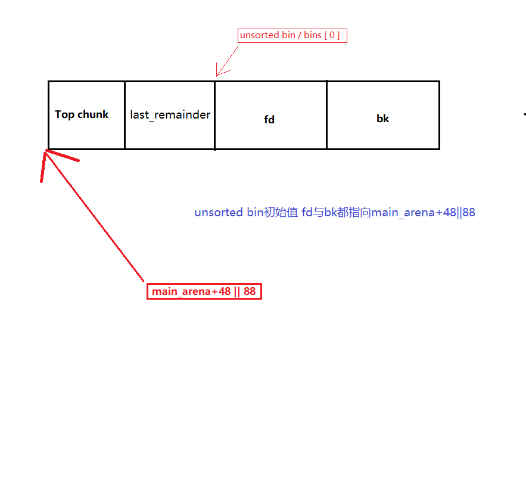

## Unsorted Bin Attack

* 当一个较大的 chunk 被分割成两半后，如果剩下的部分大于 MINSIZE，就会被放到 unsorted bin 中。
* 释放一个不属于 fast bin 的 chunk，并且该 chunk 不和 top chunk 紧邻时，该 chunk 会被首先放到 unsorted bin 中。关于top chunk的解释，请参考下面的介绍。
* 当进行 `malloc_consolidate` 时，可能会把合并后的 chunk 放到 unsorted bin 中，如果不是和 top chunk 近邻的话。
* Unsorted Bin 在使用的过程中，采用的遍历顺序是 FIFO，即插入的时候插入到 unsorted bin 的头部，取出的时候从链表尾获取。
* 在程序 malloc 时，如果在 fastbin，small bin 中找不到对应大小的 chunk，就会尝试从 Unsorted Bin 中寻找 chunk。如果取出来的 chunk 大小刚好满足，就会直接返回给用户，否则就会把这些 chunk 分别插入到对应的 bin 中。



在 Unsorted Bin  中它自身的fd总指向 Unsorted Bin 的双向链表头，bk指向双向链表尾部

**利用过程**：


***初始状态时***

unsorted bin 的 fd 和 bk 均指向 unsorted bin 本身。

***执行free(p)****

由于释放的 chunk 大小不属于 fast bin 范围内，所以会首先放入到 unsorted bin 中。

***修改p[1]***

经过修改之后，原来在 unsorted bin 中的 p 的 bk 指针就会指向 target addr-16 处伪造的 chunk，即 Target Value 处于伪造 chunk 的 fd 处。

***申请chunk***

此时，所申请的 chunk 处于 small bin 所在的范围，其对应的 bin 中暂时没有 chunk，所以会去unsorted bin中找，发现 unsorted bin 不空，于是把 unsorted bin 中的最后一个 chunk 拿出来。

```c
while ((victim = unsorted_chunks(av)->bk) != unsorted_chunks(av)) {
    bck = victim->bk;
    if (__builtin_expect(chunksize_nomask(victim) <= 2 * SIZE_SZ, 0) ||
        __builtin_expect(chunksize_nomask(victim) > av->system_mem, 0))
        malloc_printerr(check_action, "malloc(): memory corruption",
                        chunk2mem(victim), av);
    size = chunksize(victim);

    /*
       If a small request, try to use last remainder if it is the
       only chunk in unsorted bin.  This helps promote locality for
       runs of consecutive small requests. This is the only
       exception to best-fit, and applies only when there is
       no exact fit for a small chunk.
     */
    /* 显然，bck被修改，并不符合这里的要求*/
    if (in_smallbin_range(nb) && bck == unsorted_chunks(av) &&
        victim == av->last_remainder &&
        (unsigned long) (size) > (unsigned long) (nb + MINSIZE)) {
        ....
    }

    /* remove from unsorted list */
    unsorted_chunks(av)->bk = bck;
    bck->fd = unsorted_chunks(av);
    
	if (size == nb) {
		set_inuse_bit_at_offset(victim, size);
		if (av != &main_arena)
		victim->size |= NON_MAIN_ARENA;
		check_malloced_chunk(av, victim, nb);
		void *p =  chunk2mem(victim);
		if ( __builtin_expect (perturb_byte, 0))
		alloc_perturb (p, bytes);
		return p;
	}

```

取出的简化源代码：

```c
victim = unsorted_chunks(av)->bk
 //取得Unsorted Bin中bk 也就是链表尾chunk的地址
bck = victim->bk
 //取得链表中倒数第二个chunk的地址
unsorted_chunks(av)->bk= bck
 //将Unsorted Bin中bk设置为 链表中倒数第二个chunk的地址
bck->fd == unsorted_chunks(av);  //利用点
 //将链表中倒数第二个chunk的fd设置为 main_arena+48 || 88
```

漏洞利用就在这里了：

```c
victim  =  unsorted_chunks(av)->bk  =  p
bck  =  victim->bk  =  p->bk  =  target_addr-16
unsorted_chunks(av)->bk  =  bck  =  target_addr-16
bck->fd  =  *(target_addr -16+16)  =  unsorted_chunks(av);
```
可以看出，在将 unsorted bin 的最后一个 chunk 拿出来的过程中，victim 的 fd 并没有发挥作用，所以即使我们修改了其为一个不合法的值也没有关系。然而，需要注意的是，unsorted bin 链表可能就此破坏，再次插入 chunk 时，可能会出现问题。


## 注意事项

由于Unsorted Bin Attack 更改了Unsorted Bin chunk的bk指针，使其指向了构造的地址附近

```c
while ((victim = unsorted_chunks(av)->bk) != unsorted_chunks(av)) {
            bck = victim->bk;
            if (__builtin_expect(chunksize_nomask(victim) <= 2 * SIZE_SZ, 0) ||
                __builtin_expect(chunksize_nomask(victim) > av->system_mem, 0))
                malloc_printerr(check_action, "malloc(): memory corruption",
                                chunk2mem(victim), av);
```
当再次while遍历Unsorted Bin中的chunk时，显然`unsorted_chunks(av)->bk) != unsorted_chunks(av)`成立，但这时的`victim`已经是一段错乱的chunk，执行`chunksize_nomask`很有可能会触发堆块大小不匹配的错误，进一步触发malloc_printerr 等一系列函数...


但是如果之前在分配chunk时，分配的大小正好和Unsorted Bin中的chunk大小一致

```c
if (size == nb) {
	set_inuse_bit_at_offset(victim, size);
	if (av != &main_arena)
	victim->size |= NON_MAIN_ARENA;
	check_malloced_chunk(av, victim, nb);
	void *p =  chunk2mem(victim);
	if ( __builtin_expect (perturb_byte, 0))
	alloc_perturb (p, bytes);
	return p;
		}
```
如果当前遍历的 chunk 与所需的 chunk 大小一致，将当前 chunk 返回。首先设置当前chunk 处于 inuse 状态，该标志位处于相邻的下一个 chunk 的 size 中，如果当前分配区不是主分配区，设置当前 chunk 的非主分配区标志位，最后调用 chunk2mem()获得 chunk 中可用的内存指针，返回给应用层，退出。  就不会出现上面的错误。

## 利用途径

unsorted bin attack 确实可以修改任意地址的值，但是所修改成的值却不受我们控制，唯一可以知道的是，这个值比较大。而且，需要注意的是，

这看起来似乎并没有什么用处，但是其实还是有点卵用的，比如说:

* 我们通过修改循环的次数来使得程序可以执行多次循环。
* 我们可以修改 heap 中的 global_max_fast 来使得更大的 chunk 可以被视为 fast bin，这样我们就可以去执行一些 fast bin attack了。
* 最后一步申请chunk时只要不等于unsorted bin里面的chunk大小，便可以进入`malloc_printerr`流程.覆盖 `_IO_list_all`为main_arena+48或88，这时unsorted bin中的chunk会被链入`small_bin`,至于是bins[n],n就得看chunk大小；使得`_IO_list_all`结构的`_chain`刚好就是bins[n]，在bins[n]也就是之前的unsorted bin chunk中构造新的
`_IO_FILE`。这也就是`_IO_FILE`利用的FSOP（File Stream Oriented Programmin）


