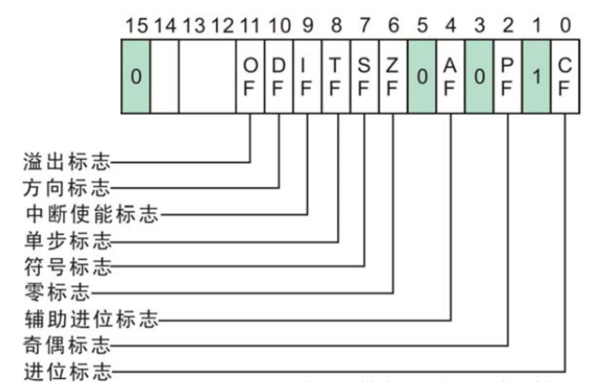

8086CPU的flag寄存器（16位）各标志位如下（这是32位EFLAG的低十六位图，但是32位与16位是一样的，只不过32位多了16位且高16位没有使用到）

标志位寄存器中保存的是当前指令运算的信息状态，比如进位信息保存在CF标志位（注意：是运算结果的标志，比如add、sub、mul、div、and、or等，而mov、push等不会改变标志位）。

其中CF为进位标志（Carry Flag），OF为溢出标志（Overflow Flag）。CF标志位的进位标志与OF标志位的溢出标志是不同的概念。

* CF针对无符号数(将寄存器中的操作数都看作是无符号数) 
* OF针对有符号数(将寄存器中的操作数都看作是有符号数) 

**所以溢出的概念，只是针对于有符号数；进位的概念，只是针对于无符号数。这一点很重要**

有符号无符号指的是最高位是否是符号位，即是以补码的形式看待还是以原码的形式看待。 
CF范围：0~255/0X00~0XFF（8位）、0~65535/0X0000~0XFFFF（16位）、… 
OF范围：-128~127/0X80~0XEF（8位）、-32768~32767/0X8000~0XEFFF（16位）

**区别 ：**

以8位寄存器作为操作种数据来源为例，如果一个运算的结果最终超过[-128，127]无论是大于127还是小于-128就被认为是溢出，OF被置为1，如果结果在[-128，127]就认为没溢出OF被置为0,。 
而对于OF：如果计算的结果超过[0，255]的范围，就有进位，CF就被置为1，如果结果再[-128，127]范围内，就是没有进位CF被置为0。如下：

（1）、8H+8H： 

对于signed：(8)+(8)=16,没超过[-128,127]的范围，OF为0 

对于unsigned：(8)+(8)=16,没超过[0,255]的范围，CF为0 

（2）、80H+81H： 

对于signed：(-128)+(-127)=-255,超过[-128,127]的范围，OF为1 

对于unsigned：(128)+(129)=257,超过[0,255]的范围，CF为1 

（3）、FCH+05H： 

对于signed：(-4)+(5)=1,没有超过[-128,127]的范围，OF为0 

对于unsigned：(252)+(5)=257,超过[0,255]的范围，CF为1 

（4）、7FH+2H： 

对于signed：(127)+(2)=129,超过[-128,127]的范围，OF为1 

对于unsigned：(127)+(2)=129,没超过[0,255]的范围，CF为0