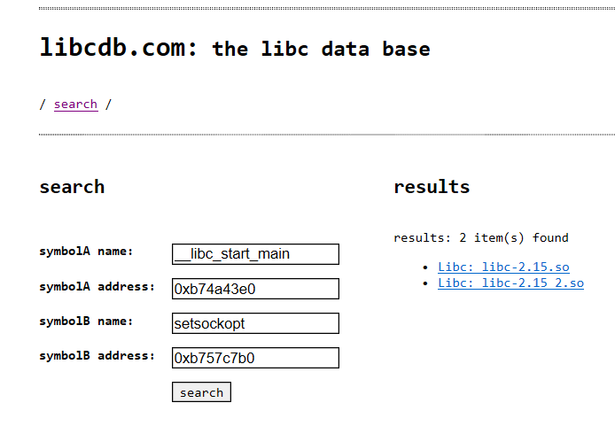
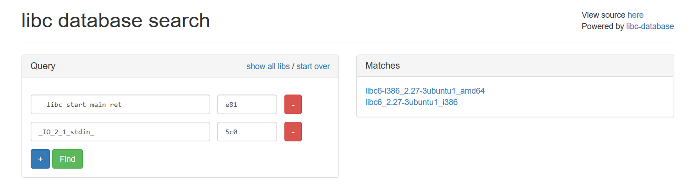

虽然DynELF是一个dump利器，但是有时候我们也会碰到一些令人尴尬的意外情况，比如写不出来leak函数，下libc被墙等等。这一节我们来介绍一些可行的解决方案。
首先要介绍的是[libcdb.com](http://libcdb.com/)，这是一个用来在线查询libc版本的网站。

从它的界面我们可以看出来，这个网站的使用相当简单，只需要我们泄露出两个函数的内存地址。只要程序存在可以用来泄露内存的漏洞。不过尴尬的是libcdb.com里好像搜不到我们用的Ubuntu.17.04里面的libc，所以在这里就不做演示了。

第二个推荐的网站是[https://libc.blukat.me](https://libc.blukat.me)。这个网站同样可以通过泄露的地址来查询libc。我们通过给出__libc_start_main和read的地址后三位可以查到libc版本

并且查询结果还以`__libc_start_main`为基准给出了常用符号和所有符号的偏移。

还有一个推荐的方法是在比赛中使用其他题目的libc。如果一个题目无法获取到libc，通常可以尝试一下使用其他题目获取到的libc做题，有时候可能所有同平台的题目都部署在同一个版本的系统中。

也可以使用本地搭建的libc-database，自己根据需要添加或者更新libc文件。下载见[https://github.com/yxshyj/libc-database](https://github.com/yxshyj/libc-database)。项目的db文件夹里有到目前2018.8月为止的symbols和info文件。