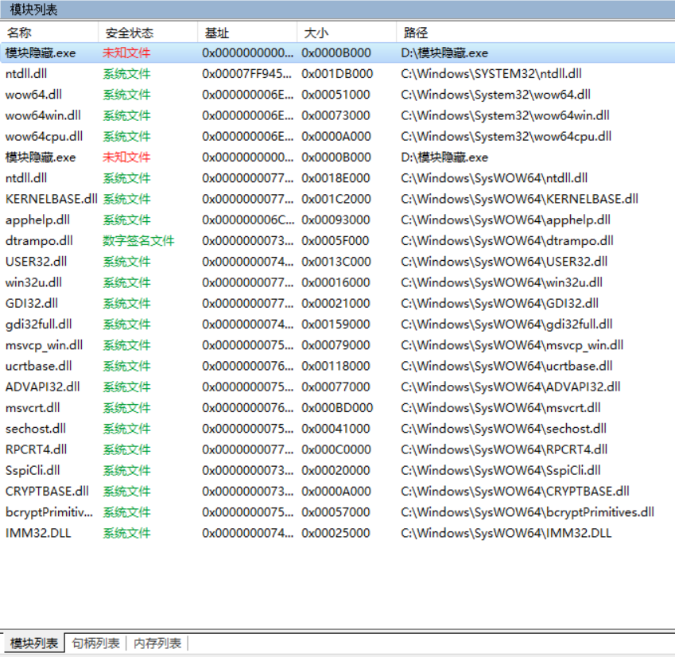

## 0x00 原理简述
* 利用fs寄存器，找到TEB的地址->PEB的地址。PEB的0xC偏移处为一个指向PEB\_LDR\_DATA结构体的指针Ldr，PEB\_LDR\_DATA的0xC的偏移处为一个指向LIST\_ENTRY结构体的指针InLoadOrderModuleList，这是一个按加载顺序构成的双向模块链表。同时LIST\_ENTRY的父结构体为LDR\_DATA\_TABLE\_ENTRY，该结构体里有俩有用信息->0x18  DLLBase(模块基址), ->0x2c  BaseDllName(指向UNICODE_STRING结构体 模块名字为unicode类型）.我们只需要获得当前进程想要隐藏的模块基址，再分别把它在InLoadOrderModuleList链，InMemoryOrderModuleList链，InInitializationOrderModuleList链中的模块节点摘掉，便可以隐藏dll。

## 0x01 代码实现

1, 定义UNICODE\_STRING ， PEB\_LDR_DATA ，LDR\_DATA\_TABLE\_ENTRY结构体

```c
typedef struct UNICODE_STRING
{
	USHORT _ength;
	USHORT MaximumLength;
	PWSTR Buffer;
}UNICODE_STRING,*PUNICODE_STRING;

typedef struct PEB_LDR_DATA{
	ULONG Length;
	BOOLEAN initialized;
	PVOID SsHandle;
	LIST_ENTRY InLoadOrderModuleList;
	LIST_ENTRY InMemoryOrderModuleList;
	LIST_ENTRY InInitializationOrderModuleList;
	
}PEB_LDR_DATA,*PPEB_LDR_DATA;

typedef struct LDR_DATA_TABLE_ENTRY
{
	LIST_ENTRY InLoadOrderModuleList;
	LIST_ENTRY InMemoryOrderModuleList;
	LIST_ENTRY InInitializationOrderModuleList;
	void* BaseAddress;
	void* EntryPoint;
	ULONG SizeOfImage;
	UNICODE_STRING FullDllName;
	UNICODE_STRING BaseDllName;
	ULONG Flags;
	SHORT LoadCount;
	SHORT TlsIndex;
	HANDLE SectionHandle;
	ULONG CheckSum;
	ULONG TimeDateStamp;
}LDR_MODULE,*PLDR_MODULE;
```
2,获取要隐藏模块基址，内联汇编，找到指向InLoadOrderModuleList头的指针pBeg，pPLD指向下一个模块。

```c
HMODULE hMod=::GetModuleHandle(szModuleName);
LDR_MODULE *pPLD=NULL,*pBeg=NULL;	
__asm{
	
	mov eax,fs:[0x30]
		mov eax,[eax+0x0c]
		add eax,0x0c
		mov pBeg,eax
		mov eax,[eax]
		mov pPLD,eax 
}
```
3, 遍历，找到对应模块基址，3条链，摘链操作。

```c
do
{
	if(hMod==pPLD->BaseAddress)
	{
		pPLD->InLoadOrderModuleList.Blink->Flink =
			pPLD->InLoadOrderModuleList.Flink;
		pPLD->InLoadOrderModuleList.Flink->Blink =
			pPLD->InLoadOrderModuleList.Blink;
		pPLD->InInitializationOrderModuleList.Blink->Flink =
			pPLD->InInitializationOrderModuleList.Flink;
		pPLD->InInitializationOrderModuleList.Flink->Blink =
			pPLD->InInitializationOrderModuleList.Blink;
		pPLD->InMemoryOrderModuleList.Blink->Flink =
			pPLD->InMemoryOrderModuleList.Flink;
		pPLD->InMemoryOrderModuleList.Flink->Blink =
			pPLD->InMemoryOrderModuleList.Blink;
		break;
	}
	pPLD=(LDR_MODULE*)pPLD->InLoadOrderModuleList.Flink;
}
while(pBeg!=pPLD);
```
## 0x02 完整代码

```c
#include<stdio.h>
#include<windows.h>

typedef struct UNICODE_STRING
{
	USHORT _ength;
	USHORT MaximumLength;
	PWSTR Buffer;
}UNICODE_STRING,*PUNICODE_STRING;

typedef struct PEB_LDR_DATA{
	ULONG Length;
	BOOLEAN initialized;
	PVOID SsHandle;
	LIST_ENTRY InLoadOrderModuleList;
	LIST_ENTRY InMemoryOrderModuleList;
	LIST_ENTRY InInitializationOrderModuleList;
	
}PEB_LDR_DATA,*PPEB_LDR_DATA;

typedef struct LDR_DATA_TABLE_ENTRY
{
	LIST_ENTRY InLoadOrderModuleList;
	LIST_ENTRY InMemoryOrderModuleList;
	LIST_ENTRY InInitializationOrderModuleList;
	void* BaseAddress;
	void* EntryPoint;
	ULONG SizeOfImage;
	UNICODE_STRING FullDllName;
	UNICODE_STRING BaseDllName;
	ULONG Flags;
	SHORT LoadCount;
	SHORT TlsIndex;
	HANDLE SectionHandle;
	ULONG CheckSum;
	ULONG TimeDateStamp;
}LDR_MODULE,*PLDR_MODULE;

void HideModule(char *szModuleName)
{
	HMODULE hMod=::GetModuleHandle(szModuleName);
	LDR_MODULE *pPLD=NULL,*pBeg=NULL;	
	__asm{
		
		mov eax,fs:[0x30]
			mov eax,[eax+0x0c]
			add eax,0x0c
			mov pBeg,eax
			mov eax,[eax]
			mov pPLD,eax 
	}
	
	do
	{
		if(hMod==pPLD->BaseAddress)
		{
			pPLD->InLoadOrderModuleList.Blink->Flink =
				pPLD->InLoadOrderModuleList.Flink;
			pPLD->InLoadOrderModuleList.Flink->Blink =
				pPLD->InLoadOrderModuleList.Blink;
			pPLD->InInitializationOrderModuleList.Blink->Flink =
				pPLD->InInitializationOrderModuleList.Flink;
			pPLD->InInitializationOrderModuleList.Flink->Blink =
				pPLD->InInitializationOrderModuleList.Blink;
			pPLD->InMemoryOrderModuleList.Blink->Flink =
				pPLD->InMemoryOrderModuleList.Flink;
			pPLD->InMemoryOrderModuleList.Flink->Blink =
				pPLD->InMemoryOrderModuleList.Blink;
			break;
		}
		pPLD=(LDR_MODULE*)pPLD->InLoadOrderModuleList.Flink;
	}
	while(pBeg!=pPLD);
	
}

int main()
{
	HideModule("kernel32.dll");
	getchar();
	return 0;
}
```
## 0x03 运行结果
* 测试环境：win10 x64
* 测试工具：火绒剑
* 本次实验隐藏的是内核模块 kernel32.dll
* 运行程序后 发现找不到kernel32.dll这个模块



