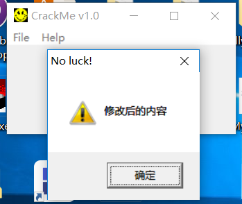

## 0x00 原理简介

IAT（Import Address Table，输入地址表）：当PE文件装入的时候，Windows加载器的工作之一就是定位所有被输入的函数和数据，并且让正在被装入的文件可以使用那些地址，输入函数就是被程序调用但其执行代码又不在程序中的函数，这些函数的代码位于相关的dll等文件中，当然只有被程序调用到的函数才会出现在IAT中（EAT是PE中所有导出的函数或者变量，注意区别，一般的EXE文件不会有导出表，但并不是说EXE不能导出函数或者变量）。HOOK IAT就是钩住感兴趣的函数，然后改变程序的执行流程或者对该函数进行监控。

## 0x01 代码实现
>本次实验基于[dll远程线程注入](http://sirhc.xyz/2018/06/15/dll%E6%B3%A8%E5%85%A5%E4%B9%8B%E8%BF%9C%E7%A8%8B%E7%BA%BF%E7%A8%8B%E6%B3%A8%E5%85%A5/)

1,HOOK函数MessageBox，首先定义一个用于替换的MyMessageBox函数。

```c
int WINAPI MyMessageBox(HWND hWnd,LPCSTR lpText,LPCSTR lpCaption,UINT uType)
{
	char lpNewText[]="修改后的内容";
	typedef int (WINAPI *PFNMESSAGEBOX)(HWND,LPCSTR,LPCSTR,UINT);
	int ret=((PFNMESSAGEBOX)g_dwOldAddr)(hWnd,lpNewText,lpCaption,uType);
	return ret;
}
```
2,得到模块基址，并找到该PE模块中IAT表的位置

```c
dwImageBase=(DWORD)::GetModuleHandle(NULL);
pNtHeader=(PIMAGE_NT_HEADERS)(dwImageBase+((PIMAGE_DOS_HEADER)dwImageBase)->e_lfanew);
pImportDescriptor=(PIMAGE_IMPORT_DESCRIPTOR)(dwImageBase+pNtHeader->OptionalHeader.DataDirectory[IMAGE_DIRECTORY_ENTRY_IMPORT].VirtualAddress);
```
3,遍历IAt表,找到要HOOK的MessageBox函数地址,找到后先修改内存页的属性为PAGE_READWRITE,再修改当前位置为MyMessageBox函数地址，恢复内存页属性。

```c
while(pImportDescriptor->FirstThunk!=0 && bFlag == FALSE)
{
	pFuncAddr=(PDWORD)(dwImageBase+pImportDescriptor->FirstThunk);
	
	while(*pFuncAddr)
	{
		if(dwOldAddr == *pFuncAddr)
		{
			VirtualProtect(pFuncAddr,sizeof(DWORD),PAGE_READWRITE,&dwOldProtect);
			*pFuncAddr=dwNewAddr;
			VirtualProtect(pFuncAddr,sizeof(DWORD),dwOldProtect,0);
			bFlag=TRUE; 
			break;
		}
		pFuncAddr=(PDWORD)((DWORD)pFuncAddr+sizeof(DWORD));
	}
	pImportDescriptor=(PIMAGE_IMPORT_DESCRIPTOR)((DWORD)pImportDescriptor+sizeof(IMAGE_IMPORT_DESCRIPTOR));
}
```

## 0x02 完整代码

>这是个dll文件

```c
#include "stdafx.h"
#include<stdio.h>
#include<windows.h>
#include<stdlib.h>
#include<Tlhelp32.h.>

DWORD g_dwIATHookFlag=0; // #HOOK状态 (1 HOOK  0 未HOOK)
DWORD g_dwOldAddr;
DWORD g_dwNewAddr;

BOOL SetIATHook(DWORD dwOldAddr,DWORD dwNewAddr)
{
	BOOL bFlag =FALSE;
	DWORD dwImageBase=0;
	PDWORD pFuncAddr=NULL;
	PIMAGE_NT_HEADERS pNtHeader =NULL;
	PIMAGE_IMPORT_DESCRIPTOR pImportDescriptor=NULL;
	DWORD dwOldProtect=0;
	
	// #得到模块基址
	dwImageBase=(DWORD)::GetModuleHandle(NULL);
	pNtHeader=(PIMAGE_NT_HEADERS)(dwImageBase+((PIMAGE_DOS_HEADER)dwImageBase)->e_lfanew);
	pImportDescriptor=(PIMAGE_IMPORT_DESCRIPTOR)(dwImageBase+pNtHeader->OptionalHeader.DataDirectory[IMAGE_DIRECTORY_ENTRY_IMPORT].VirtualAddress);
	
	// #遍历IAt表 找到这个函数地址
	while(pImportDescriptor->FirstThunk!=0 && bFlag == FALSE)
	{
		pFuncAddr=(PDWORD)(dwImageBase+pImportDescriptor->FirstThunk);
		
		while(*pFuncAddr)
		{
			// #找到要HOOK的函数，先修改内存的属性
			if(dwOldAddr == *pFuncAddr)
			{
				VirtualProtect(pFuncAddr,sizeof(DWORD),PAGE_READWRITE,&dwOldProtect);
				*pFuncAddr=dwNewAddr;
				// #恢复内存页属性
				VirtualProtect(pFuncAddr,sizeof(DWORD),dwOldProtect,0);
				bFlag=TRUE; 
				break;
			}
			pFuncAddr=(PDWORD)((DWORD)pFuncAddr+sizeof(DWORD));
		}
		pImportDescriptor=(PIMAGE_IMPORT_DESCRIPTOR)((DWORD)pImportDescriptor+sizeof(IMAGE_IMPORT_DESCRIPTOR));
	}
	g_dwOldAddr=dwOldAddr;
	g_dwNewAddr=dwNewAddr;
	g_dwIATHookFlag=1;
	return bFlag;
}


BOOL UnIATHook()
{
	BOOL bFlag =FALSE;
	DWORD dwImageBase=0;
	PDWORD pFuncAddr=NULL;
	PIMAGE_NT_HEADERS pNtHeader=NULL;
	PIMAGE_IMPORT_DESCRIPTOR pImportDescriptor =NULL;
	DWORD dwOldProtect =0;
	// #判断是否HOOK
	if(!g_dwIATHookFlag)
	{
		OutputDebugString("UnIATHook失败：尚未进行IAT HOOK!");
		return bFlag;
	}
	// #得到模块基址
	dwImageBase=(DWORD)::GetModuleHandle(NULL);
	pNtHeader=(PIMAGE_NT_HEADERS)(dwImageBase+((PIMAGE_DOS_HEADER)dwImageBase)->e_lfanew);
	pImportDescriptor=(PIMAGE_IMPORT_DESCRIPTOR)(dwImageBase+pNtHeader->OptionalHeader.DataDirectory[IMAGE_DIRECTORY_ENTRY_IMPORT].VirtualAddress);
	
	// #遍历IAt表 找到这个函数地址
	while(pImportDescriptor->FirstThunk!=0 && bFlag == FALSE)
	{
		pFuncAddr=(PDWORD)(dwImageBase+pImportDescriptor->FirstThunk);
		
		while(*pFuncAddr)
		{
			// #找到要HOOK的函数，先修改内存的属性
			if(g_dwNewAddr == *pFuncAddr)
			{
				// #找到被HOOK的函数
				VirtualProtect(pFuncAddr,sizeof(DWORD),PAGE_READWRITE,&dwOldProtect);
				*pFuncAddr=g_dwNewAddr;
				// #恢复内存页属性
				VirtualProtect(pFuncAddr,sizeof(DWORD),dwOldProtect,0);
				bFlag=TRUE;
				break;
			}
			pFuncAddr++;
		}
		pImportDescriptor =(PIMAGE_IMPORT_DESCRIPTOR)((DWORD)pImportDescriptor+sizeof(IMAGE_IMPORT_DESCRIPTOR));
	}
	// #修改状态
	g_dwOldAddr=0;
	g_dwNewAddr=0;
	g_dwIATHookFlag=0;
	return bFlag;
}

int WINAPI MyMessageBox(HWND hWnd,LPCSTR lpText,LPCSTR lpCaption,UINT uType)
{
	char lpNewText[]="修改后的内容";
	// #定义MessageBox函数指针
	typedef int (WINAPI *PFNMESSAGEBOX)(HWND,LPCSTR,LPCSTR,UINT);
	// #执行真正的函数
	int ret=((PFNMESSAGEBOX)g_dwOldAddr)(hWnd,lpNewText,lpCaption,uType);
	return ret;
}

DWORD WINAPI ThreadProc(LPVOID lParam)
{
	// #保存原函数的地址
	DWORD pOldFuncAddr=(DWORD)GetProcAddress(LoadLibrary("user32.dll"),"MessageBoxA");
	// #安装或者卸载HOOK
	if(!g_dwIATHookFlag)
	{
		SetIATHook(pOldFuncAddr,(DWORD)MyMessageBox);
	}
	else
	{
		UnIATHook();
	}
	return 0;
}
BOOL APIENTRY DllMain( HANDLE hModule, 
					  DWORD  ul_reason_for_call, 
					  LPVOID lpReserved
					  )
{
	
	
	switch (ul_reason_for_call)
		
	{
	case DLL_PROCESS_ATTACH:
		CreateThread(NULL,0,(LPTHREAD_START_ROUTINE)ThreadProc,NULL,0,NULL);
		break;
	case DLL_THREAD_ATTACH:
		break;
	case DLL_THREAD_DETACH:
		break;
	case DLL_PROCESS_DETACH:
		break;
	}
    return TRUE;
}
```

## 0x03实验结果
* 实验环境: win10
* 对象程序: [crackme.exe](https://github.com/yxshyj/project/blob/master/other/crackme.exe)

单击程序Help的Register,随便输入注册账号和密码



